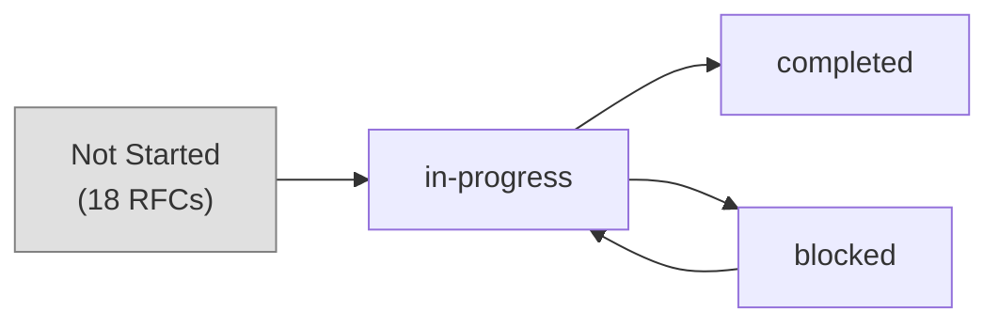

# Documentation Dependencies
*Generated: 2025-11-20 06:56:13*

## Implementation Status Flow
*Current distribution of RFCs by implementation status*

```mermaid
flowchart LR
    not-started["Not Started<br/>(18 RFCs)"]:::not-started

    not-started --> in-progress
    in-progress --> completed
    in-progress --> blocked
    blocked --> in-progress

    classDef not-started fill:#E0E0E0,stroke:#808080
    classDef in-progress fill:#87CEEB,stroke:#4682B4,stroke-width:2px
    classDef blocked fill:#FFB6C1,stroke:#DC143C,stroke-width:2px
    classDef completed fill:#90EE90,stroke:#006400,stroke-width:2px
```
