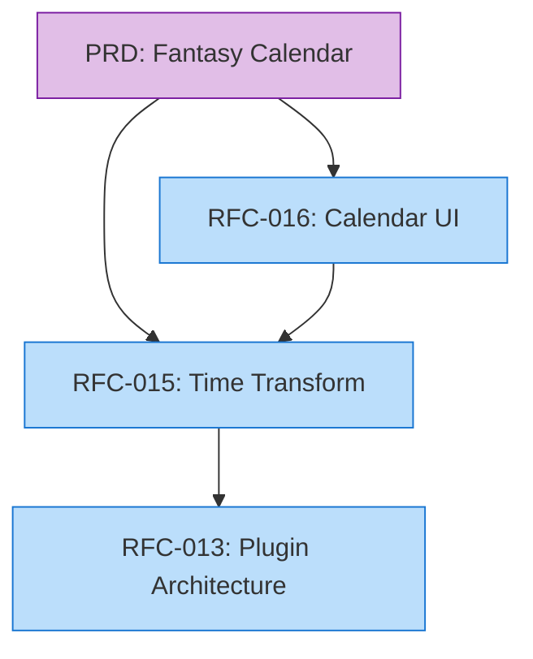

# PRD-RFC Relationship Schema

## Overview
Product Requirement Documents (PRDs) and RFCs serve different purposes:

- **PRD**: What to build and why (product perspective)
- **RFC**: How to build it (technical perspective)

**Recommended Approach**: PRDs reference RFCs (one-to-many relationship)


## PRD Front-Matter Extension
```yaml
---
doc_id: 'PRD-00001'
title: 'Fantasy Calendar System'
doc_type: 'prd'
status: 'active'
canonical: true
created: '2025-11-20'
tags: ['product', 'calendar', 'time-system']
summary: 'Product requirements for fantasy calendar system'
implementation:
  rfcs: ['RFC-2025-00015']  # RFCs that implement this PRD
  status: 'in-progress'
---
```

## RFC Front-Matter Extension
```yaml
---
doc_id: 'RFC-00015'
title: 'Fantasy Calendar to Real-World Time Transformation'
doc_type: 'rfc'
# ... other fields ...
implements: 'PRD-2025-00001'  # PRD this RFC implements
dependencies:
  rfcs: ['RFC-2025-00013']  # Other RFCs this depends on
  prds: []  # Additional PRDs (if implementing multiple)
---
```

## Relationship Types

### 1. PRD → RFC (Implementation)
- **Direction**: PRD references RFCs
- **Cardinality**: One PRD → Many RFCs
- **Field**: `implementation.rfcs` in PRD
- **Use Case**: Track which RFCs implement a product requirement

### 2. RFC → PRD (Implements)
- **Direction**: RFC references PRD
- **Cardinality**: One RFC → One PRD (typically)
- **Field**: `implements` in RFC
- **Use Case**: Show product context for technical design

### 3. RFC → RFC (Dependencies)
- **Direction**: RFC references other RFCs
- **Cardinality**: Many-to-many
- **Field**: `dependencies.rfcs` in RFC
- **Use Case**: Technical dependencies between designs


## Visualization


## Benefits
1. **Traceability**: Track from product requirement to technical implementation
2. **Impact Analysis**: See which RFCs are affected by PRD changes
3. **Completeness**: Verify all PRD requirements have RFC coverage
4. **Context**: Understand product rationale behind technical decisions
