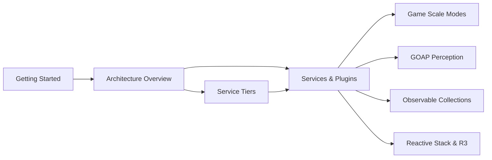
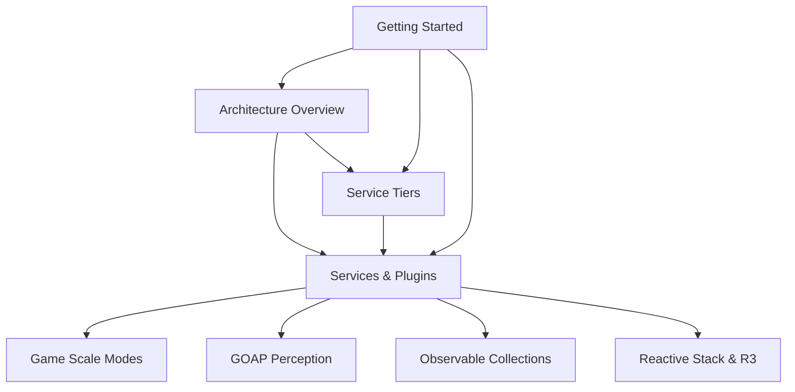

# .NET Documentation Navigation Guide

This guide helps you navigate the .NET documentation efficiently based on your role and goals.

## 🎯 Quick Navigation by Role

### 👨‍💻 New Developers

**Goal**: Get up and running quickly with the .NET implementation

1. **[Getting Started](./guides/getting-started.md)** - Environment setup and first run
2. **[Architecture Overview](./architecture/overview.md)** - Understand the big picture
3. **[Service Tiers](./architecture/service-tiers.md)** - Learn the application structure
4. **[Services and Plugins](./architecture/services-and-plugins.md)** - Understand extensibility

### 🏗️ Architects

**Goal**: Understand system design and make architectural decisions

1. **[Architecture Overview](./architecture/overview.md)** - ECS design, rendering pipeline, plugin system
2. **[Game Scale Modes](./architecture/game-scale-modes.md)** - Multi-scale world design
3. **[Service Tiers](./architecture/service-tiers.md)** - Four-tier architecture
4. **[Services and Plugins](./architecture/services-and-plugins.md)** - Plugin system integration
5. **Related RFCs**: [RFC-005](../rfcs/005-project-structure-reorganization.md), [RFC-006](../rfcs/006-plugin-system-architecture.md)

### 🔌 Plugin Developers

**Goal**: Create plugins that extend the system

1. **[Services and Plugins](./architecture/services-and-plugins.md)** - Plugin system overview
2. **[Getting Started](./guides/getting-started.md)** - Development environment
3. **[Architecture Overview](./architecture/overview.md)** - Understand plugin integration points
4. **[Service Tiers](./architecture/service-tiers.md)** - Service registration patterns

### 🤖 AI/Gameplay Developers

**Goal**: Implement AI and gameplay systems

1. **[Architecture Overview](./architecture/overview.md)** - ECS and component patterns
2. **[GOAP Perception Checklist](./architecture/goap-perception-checklist.md)** - AI system integration
3. **[Game Scale Modes](./architecture/game-scale-modes.md)** - Multi-scale considerations
4. **[Observable Collections](./architecture/observable-collections.md)** - Reactive patterns for AI

### 🎨 UI/Rendering Developers

**Goal**: Implement user interfaces and rendering

1. **[Architecture Overview](./architecture/overview.md)** - Rendering pipeline overview
2. **[Observable Collections](./architecture/observable-collections.md)** - Reactive UI patterns
3. **[Reactive Stack and R3](./architecture/reactive-stack-and-r3.md)** - Reactive extensions
4. **[Getting Started](./guides/getting-started.md)** - Platform-specific setup

## 🗺️ Document Relationship Map

### Core Architecture Flow

### Implementation Dependencies

## 📚 Learning Paths

### Path 1: Foundation (Everyone)

1. [Getting Started](./guides/getting-started.md) → 2. [Architecture Overview](./architecture/overview.md) → 3. [Service Tiers](./architecture/service-tiers.md)

### Path 2: Plugin Development

1. Foundation Path → 2. [Services and Plugins](./architecture/services-and-plugins.md) → 3. [Related RFCs](../rfcs/006-plugin-system-architecture.md)

### Path 3: Game Systems

1. Foundation Path → 2. [Game Scale Modes](./architecture/game-scale-modes.md) → 3. [GOAP Perception](./architecture/goap-perception-checklist.md)

### Path 4: UI/Rendering

1. Foundation Path → 2. [Observable Collections](./architecture/observable-collections.md) → 3. [Reactive Stack & R3](./architecture/reactive-stack-and-r3.md)

## 🔍 Cross-Reference Index

### By Technology

- **ECS (Entity Component System)**: [Architecture Overview](./architecture/overview.md), [Getting Started](./guides/getting-started.md)
- **Plugin System**: [Architecture Overview](./architecture/overview.md), [Services and Plugins](./architecture/services-and-plugins.md), [RFC-006](../rfcs/006-plugin-system-architecture.md)
- **Reactive Programming**: [Observable Collections](./architecture/observable-collections.md), [Reactive Stack & R3](./architecture/reactive-stack-and-r3.md)
- **AI Systems**: [GOAP Perception](./architecture/goap-perception-checklist.md), [Architecture Overview](./architecture/overview.md)
- **Multi-scale Rendering**: [Game Scale Modes](./architecture/game-scale-modes.md), [Architecture Overview](./architecture/overview.md)

### By Concern

- **Performance**: [Architecture Overview](./architecture/overview.md), [Service Tiers](./architecture/service-tiers.md)
- **Extensibility**: [Services and Plugins](./architecture/services-and-plugins.md), [RFC-005](../rfcs/005-project-structure-reorganization.md)
- **Testing**: [Getting Started](./guides/getting-started.md)
- **Deployment**: [Getting Started](./guides/getting-started.md)

## 🏷️ Tag-Based Navigation

### Core Concepts

- `architecture`: All architecture documents
- `ecs`: Entity Component System patterns
- `rendering`: Graphics and display systems
- `plugins`: Plugin architecture and development

### Implementation Guides

- `getting-started`: Setup and basic usage
- `reactive`: Reactive programming patterns
- `ai`: AI and gameplay systems

## 🔗 External References

### Main Project Documentation

- [Main Documentation Index](../README.md) - Project-wide documentation
- [RFC Index](../rfcs/README.md) - All RFCs and proposals
- [Architecture Documents](../architecture/) - General architecture documentation

### Related RFCs

- [RFC-005: Project Structure Reorganization](../rfcs/005-project-structure-reorganization.md) - Foundation for current structure
- [RFC-006: Plugin System Architecture](../rfcs/006-plugin-system-architecture.md) - Plugin system design
- [RFC-012: Documentation Organization Management](../rfcs/012-documentation-organization-management.md) - Documentation standards

## 📋 Quick Reference

### Document IDs

- `ADR-00001`: [Architecture Overview](./architecture/overview.md)
- `ADR-00002`: [Game Scale Modes](./architecture/game-scale-modes.md)
- `ADR-00003`: [Service Tiers](./architecture/service-tiers.md)
- `ADR-00004`: [Services and Plugins](./architecture/services-and-plugins.md)
- `ADR-00005`: [GOAP Perception Checklist](./architecture/goap-perception-checklist.md)
- `ADR-00006`: [Observable Collections](./architecture/observable-collections.md)
- `ADR-00007`: [Reactive Stack and R3](./architecture/reactive-stack-and-r3.md)
- `GUIDE-00001`: [Getting Started](./guides/getting-started.md)
- `GUIDE-00002`: This Navigation Guide
- `REFERENCE-00001`: [.NET Documentation Reference](./README.md)

### Common Tasks

- **Set up development environment**: [Getting Started](./guides/getting-started.md)
- **Understand architecture**: [Architecture Overview](./architecture/overview.md)
- **Create a plugin**: [Services and Plugins](./architecture/services-and-plugins.md)
- **Implement AI**: [GOAP Perception](./architecture/goap-perception-checklist.md)
- **Add reactive UI**: [Observable Collections](./architecture/observable-collections.md) → [Reactive Stack & R3](./architecture/reactive-stack-and-r3.md)

---

_This navigation guide is part of the RFC-012 documentation organization system. For the complete documentation index, see [.NET Documentation Reference](./README.md)._
