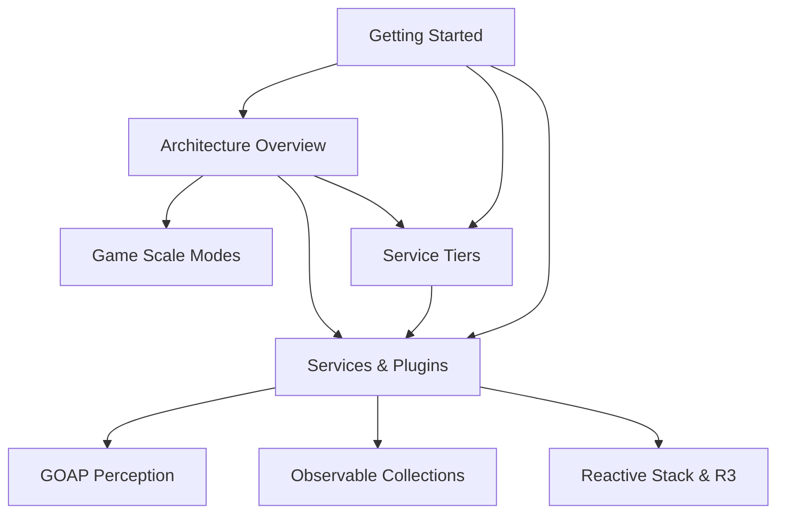

# .NET Documentation Reference

This document provides a comprehensive reference to all .NET documentation in the Pigeon Pea project.

## 🚀 Quick Start

### For New Developers

1. **[Getting Started Guide](./guides/getting-started.md)** - Set up your development environment and run your first application
2. **[Architecture Overview](./architecture/overview.md)** - Understand the high-level system design
3. **[Service Tiers](./architecture/service-tiers.md)** - Learn about the four-tier architecture

### For Architects

1. **[Architecture Overview](./architecture/overview.md)** - High-level ECS design, rendering pipeline, and plugin system
2. **[Multi-Scale World System](./architecture/game-scale-modes.md)** - Discrete zoom/mode levels design
3. **[Services and Plugins](./architecture/services-and-plugins.md)** - Plugin system integration

### For Plugin Developers

1. **[Services and Plugins](./architecture/services-and-plugins.md)** - How services, shared libraries, and plugins fit together
2. **[Getting Started Guide](./guides/getting-started.md)** - Development setup and project structure

## 📚 Documentation Structure

```
docs/dotnet/
├── architecture/          # Architecture Decision Records (ADRs)
│   ├── overview.md           # High-level architecture overview
│   ├── game-scale-modes.md  # Multi-scale world & mode system
│   ├── service-tiers.md      # Service tiers and category layout
│   ├── services-and-plugins.md # Services, shared libraries, and plugins
│   ├── goap-perception-checklist.md
│   ├── observable-collections.md
│   └── reactive-stack-and-r3.md
├── guides/               # How-to guides and tutorials
│   ├── getting-started.md  # Getting started with Pigeon Pea .NET
│   └── NAVIGATION.md      # Comprehensive navigation guide
└── reference/            # Reference documentation
    └── README.md             # This file (comprehensive reference)
```

## 🏗️ Architecture Documentation

### High-Level Architecture

- **[overview.md](./architecture/overview.md)** - High-level architecture overview of Pigeon Pea with ECS design, rendering pipeline, and plugin system

### Design Decisions

- **[game-scale-modes.md](./architecture/game-scale-modes.md)** - Design for discrete zoom/mode levels in Pigeon Pea with physical scale and chunking
- **[service-tiers.md](./architecture/service-tiers.md)** - Four-tier service architecture for app-level and game-level features
- **[services-and-plugins.md](./architecture/services-and-plugins.md)** - How services, shared libraries, and plugins fit together

### Technical Implementation

- **[goap-perception-checklist.md](./architecture/goap-perception-checklist.md)** - Implementation checklist for GOAP and perception systems integration
- **[observable-collections.md](./architecture/observable-collections.md)** - Guidelines for using observable collections and reactive extensions
- **[reactive-stack-and-r3.md](./architecture/reactive-stack-and-r3.md)** - Guidelines for integrating reactive extensions and R3

## 📖 Guides

### Getting Started

- **[getting-started.md](./guides/getting-started.md)** - Comprehensive guide to setting up and running Pigeon Pea .NET applications
- **[NAVIGATION.md](./guides/NAVIGATION.md)** - Role-based navigation guide and learning paths

## 📋 Reference Documentation

- **[README.md](./README.md)** - This comprehensive reference document

## 🗺️ Document Map & Relationships

### Document Dependencies



### Reading Order for New Team Members

1. **Start Here**: [Getting Started Guide](./guides/getting-started.md)
2. **Understand Architecture**: [Architecture Overview](./architecture/overview.md)
3. **Learn Structure**: [Service Tiers](./architecture/service-tiers.md)
4. **Explore Plugins**: [Services and Plugins](./architecture/services-and-plugins.md)
5. **Deep Dive**: Choose based on your role:
   - **Game Designers**: [Game Scale Modes](./architecture/game-scale-modes.md)
   - **AI Developers**: [GOAP Perception Checklist](./architecture/goap-perception-checklist.md)
   - **UI Developers**: [Observable Collections](./architecture/observable-collections.md) → [Reactive Stack & R3](./architecture/reactive-stack-and-r3.md)

## 🔗 Cross-References to Main Documentation

### Related RFCs

- **[RFC-005: Project Structure Reorganization](../rfcs/005-project-structure-reorganization.md)** - Plugin-based architecture foundation
- **[RFC-006: Plugin System Architecture](../rfcs/006-plugin-system-architecture.md)** - Plugin loading and lifecycle management
- **[RFC-012: Documentation Organization Management](../rfcs/012-documentation-organization-management.md)** - Documentation structure and validation

### Related Architecture Documents

- **[Rendering Architecture](../architecture/ARCHITECTURE_MAP_RENDERING.md)** - Map rendering design and implementation
- **[Plugin System Analysis](../architecture/PLUGIN_SYSTEM_ANALYSIS.md)** - Original plugin system analysis

## 🏷️ Tags Index

### By Topic

- **architecture**: [overview](./architecture/overview.md), [game-scale-modes](./architecture/game-scale-modes.md), [service-tiers](./architecture/service-tiers.md), [services-and-plugins](./architecture/services-and-plugins.md)
- **ecs**: [overview](./architecture/overview.md)
- **rendering**: [overview](./architecture/overview.md)
- **plugins**: [overview](./architecture/overview.md), [services-and-plugins](./architecture/services-and-plugins.md)
- **reactive**: [observable-collections](./architecture/observable-collections.md), [reactive-stack-and-r3](./architecture/reactive-stack-and-r3.md)
- **ai**: [goap-perception-checklist](./architecture/goap-perception-checklist.md)
- **getting-started**: [getting-started](./guides/getting-started.md)

### By Document Type

- **ADR (Architecture Decision Records)**: All documents in `architecture/` directory
- **GUIDE**: [getting-started.md](./guides/getting-started.md)
- **REFERENCE**: This document

## Legacy Documentation

The following legacy documentation has been moved and redirect files created:

- \*\*[dotnet/ARCHITECTURE.md](../dotnet/ARCHITECTURE.md) - Redirects to architecture overview
- \*\*[dotnet/docs/architecture/](../dotnet/docs/architecture/) - Redirects to new architecture documentation structure

## Document IDs

All documentation follows the RFC-012 standard with unique document IDs:

- **ADR-2025-00001**: Architecture Overview
- **ADR-2025-00002**: Multi-Scale World & Mode System
- **ADR-2025-00003**: Service Tiers and Category Layout
- **ADR-2025-00004**: Services, Shared Libraries, and Plugins
- **ADR-2025-00005**: GOAP Perception Checklist
- **ADR-2025-00006**: Observable Collections and Reactive Patterns
- **ADR-2025-00007**: Reactive Stack and R3 Integration
- **GUIDE-2025-00001**: Getting Started with Pigeon Pea .NET
- **REFERENCE-2025-00001**: .NET Documentation Reference

## Document Types

- **ADR** (Architecture Decision Record): Formal records of architectural decisions
- **GUIDE** (Guide): How-to guides and tutorials
- **REFERENCE** (Reference): Reference documentation and indexes

## Status

All documentation is currently **active** and represents the latest understanding of the .NET architecture and implementation.

## Related Documentation

- [RFC-012: Documentation Organization Management](../../rfcs/012-documentation-organization-management.md) - The RFC that defines this documentation structure
