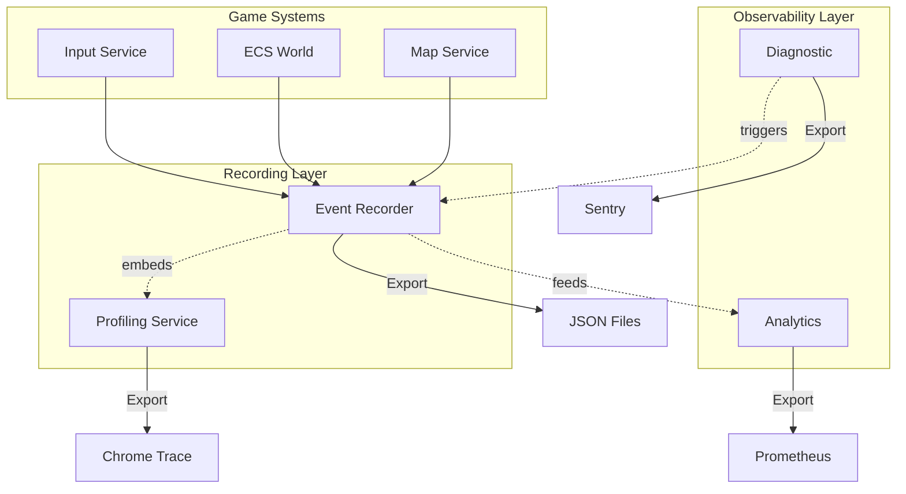

# Observability Services: How They Work Together

## Service Comparison Matrix

| Service                     | Purpose              | Data Collected           | When Used                    | Relationship to Recording                     |
| --------------------------- | -------------------- | ------------------------ | ---------------------------- | --------------------------------------------- |
| **Recording** (RFC-052-055) | Deterministic replay | Game events              | Debug bugs, regression tests | **Source of truth** - can feed other services |
| **Profiling** (RFC-049)     | Performance analysis | Timing, scopes, counters | Find slow code               | **Embedded in recordings**                    |
| **Analytics** (RFC-050)     | Usage patterns       | Metrics, traces          | Understand player behavior   | **Consumes recorded events**                  |
| **Diagnostic** (RFC-051)    | Health monitoring    | Errors, warnings, health | Production monitoring        | **Triggers recordings on error**              |

## How They Work Together



## 1. How to Analyze Recorded Data

### Built-in Analysis Tools (RFC-053)

```csharp
// A. Event Diff - Find divergence
var differ = new EventDiff();
var result = differ.Compare("run1.json", "run2.json");
Console.WriteLine($"Diverged at event {result.DivergencePoint}");

// B. Step-by-step Replay
var player = new EventPlayer();
await player.LoadAsync("bug-report.json");
while (player.Step())
{
    Console.WriteLine($"Event: {player.CurrentEvent.Type}");
    Console.WriteLine($"State: {player.CurrentState}");
}

// C. Event Statistics
var events = LoadRecording("session.json");
var stats = events
    .GroupBy(e => e.Type)
    .Select(g => new { Event = g.Key, Count = g.Count() })
    .OrderByDescending(s => s.Count);
```

### Correlation with Profiling Data

```csharp
// Recordings embed profiling data (RFC-053)
var recording = LoadRecording("session.json");

foreach (var evt in recording.Events)
{
    // Find corresponding profiling scope
    var profilingScope = recording.ProfilingData.Scopes
        .FirstOrDefault(s => s.Timestamp == evt.Timestamp);

    if (profilingScope != null)
    {
        Console.WriteLine($"{evt.Type} took {profilingScope.DurationMs}ms");

        // Flag slow events
        if (profilingScope.DurationMs > 16.67) // 60 FPS target
        {
            Console.WriteLine($"⚠️ SLOW: {evt.Type}");
        }
    }
}
```

### Verification / Correctness Testing

```csharp
// Regression test using recordings
[Test]
public async Task VerifyMapGeneration_DeterministicResult()
{
    // Record baseline
    var baselinePlayer = new EventPlayer();
    await baselinePlayer.LoadAsync("baselines/map-gen-seed-123.json");
    await baselinePlayer.PlayAsync(new PlaybackOptions { Speed = double.MaxValue });
    var baselineState = baselinePlayer.CurrentState;

    // Run current code with same seed
    var currentPlayer = new EventPlayer();
    var currentRecording = RecordNewSession(seed: 123);
    await currentPlayer.LoadAsync(currentRecording);
    await currentPlayer.PlayAsync(new PlaybackOptions { Speed = double.MaxValue });
    var currentState = currentPlayer.CurrentState;

    // Compare
    Assert.Equal(baselineState.Map, currentState.Map);
    Assert.Equal(baselineState.EntityCount, currentState.EntityCount);
}
```

## 2. Relationship to Other Services

### Recording ↔ Profiling (RFC-049)

**Recording embeds profiling data:**

```csharp
public class EventRecordingService
{
    private readonly IProfilingService _profiler;

    public async Task Save Async(string path)
    {
        // Get profiling data
        var profilingJson = _profiler.ExportToJson();

        // Embed in recording
        var recording = new RecordedSession
        {
            Events = _events,
            ProfilingData = prof ilingJson  // ← Embedded!
        };

        await File.WriteAllTextAsync(path, JsonSerializer.Serialize(recording));
    }
}
```

**Benefit**: Correlate events with performance!

```csharp
// Find which event type is slowest
var recording = LoadRecording("session.json");
var eventPerformance = recording.Events
    .Join(recording.ProfilingData.Scopes,
        e => e.Timestamp,
        p => p.Timestamp,
        (e, p) => new { Event = e.Type, Duration = p.DurationMs })
    .GroupBy(x => x.Event)
    .Select(g => new { Event = g.Key, AvgMs = g.Average(x => x.Duration) })
    .OrderByDescending(x => x.AvgMs);

foreach (var stat in eventPerformance)
{
    Console.WriteLine($"{stat.Event}: {stat.AvgMs:F2}ms avg");
}
```

### Recording → Analytics (RFC-050 OpenTelemetry)

**Analytics can consume recorded events:**

```csharp
public class AnalyticsIntegration
{
    public void ImportFromRecording(string recordingPath)
    {
        var recording = LoadRecording(recordingPath);
        var analytics = GetService<IAnalyticsService>();

        foreach (var evt in recording.Events)
        {
            // Send to analytics backend
            analytics.TrackEvent(evt.Type, evt.Data);

            // Track metrics
            if (evt.Type == "PlayerMove")
            {
                analytics.IncrementCounter("player.moves");
            }
        }
    }
}
```

**Use case**: Analyze player behavior patterns across many recordings.

### Diagnostic ↔ Recording (RFC-051 Sentry)

**Diagnostic triggers recording on error:**

```csharp
public class DiagnosticService
{
    private readonly IEventRecorder _recorder;

    public void ReportError(Exception ex)
    {
        // Auto-start recording on error
        if (!_recorder.IsRecording)
        {
            _recorder.StartRecording(seed: GetCurrentSeed());
        }

        // Report to Sentry
        SentrySdk.CaptureException(ex);

        // Save recording with error context
        await _recorder.SaveAsync($"error-reports/{ex.GetType().Name}-{DateTime.Now:yyyyMMddHHmmss}.json");
    }
}
```

**Benefit**: Every error report includes a full recording for reproduction!

## 3. Unified Logging with ILogger + Source Generators

### The Problem

Currently, game systems call multiple services:

```csharp
// Too many dependencies!
public class InputService
{
    private readonly IEventRecorder _recorder;
    private readonly IAnalyticsService _analytics;
    private readonly ILogger _logger;

    public void HandleKeyPress(KeyPress key)
    {
        _recorder.RecordEvent(new GameEvent("KeyPress", "Input", new { key }));
        _analytics.TrackEvent("KeyPress", new { key });
        _logger.LogInformation("Key pressed: {Key}", key);
    }
}
```

### The Solution: ILogger as Unified Interface

**Use Microsoft.Extensions.Logging with source generators:**

```csharp
// Define high-performance logging methods
public static partial class GameEventLog
{
    [LoggerMessage(EventId = 1001, Level = LogLevel.Information, Message = "Player moved from {From} to {To}")]
    public static partial void LogPlayerMove(this ILogger logger, Position from, Position to);

    [LoggerMessage(EventId = 1002, Level = LogLevel.Information, Message = "Enemy spawned: {EnemyId} at {Position}")]
    public static partial void LogEnemySpawn(this ILogger logger, string enemyId, Position position);

    [LoggerMessage(EventId = 1003, Level = LogLevel.Information, Message = "Map generated with seed {Seed}")]
    public static partial void LogMapGeneration(this ILogger logger, int seed);
}
```

**Game systems use ILogger only:**

```csharp
public class InputService
{
    private readonly ILogger<InputService> _logger;

    public void HandleMove(Position from, Position to)
    {
        // Single call, multiple sinks!
        _logger.LogPlayerMove(from, to);

        ProcessMove(from, to);
    }
}
```

**ILogger sinks to all services:**

```csharp
// Startup configuration
builder.Logging.AddRecordingSink();     // → EventRecorder
builder.Logging.AddAnalyticsSink();     // → Analytics
builder.Logging.AddOpenTelemetry();     // → OpenTelemetry
builder.Logging.AddSentry();            // → Sentry
```

### Custom ILogger Provider for Recording

```csharp
public class RecordingLoggerProvider : ILoggerProvider
{
    private readonly IEventRecorder _recorder;

    public ILogger CreateLogger(string categoryName)
    {
        return new RecordingLogger(_recorder, categoryName);
    }
}

public class RecordingLogger : ILogger
{
    private readonly IEventRecorder _recorder;
    private readonly string _category;

    public void Log<TState>(LogLevel logLevel, EventId eventId, TState state,
        Exception? exception, Func<TState, Exception?, string> formatter)
    {
        if (!_recorder.IsRecording) return;

        // Convert log to game event
        var evt = new GameEvent(
            Type: eventId.Name ?? $"Event{eventId.Id}",
            Category: _category,
            Data: SerializeState(state)
        );

        _recorder.RecordEvent(evt);
    }
}
```

### Benefits

| Before                      | After                   |
| --------------------------- | ----------------------- |
| ❌ Call 3 services manually | ✅ Call ILogger once    |
| ❌ Easy to forget           | ✅ Impossible to forget |
| ❌ Code duplication         | ✅ DRY                  |
| ❌ Tightly coupled          | ✅ Loosely coupled      |
| ❌ Slow (3 calls)           | ✅ Fast (source gen)    |

### Complete Example

```csharp
// 1. Define log methods (source generated)
public static partial class GameEventLog
{
    [LoggerMessage(1001, LogLevel.Information, "Player moved from {From} to {To}")]
    public static partial void LogPlayerMove(this ILogger logger, Position from, Position to);
}

// 2. Game system uses ILogger
public class InputService
{
    private readonly ILogger<InputService> _logger;

    public void HandleMove(Position from, Position to)
    {
        _logger.LogPlayerMove(from, to);  // ← Single call!
    }
}

// 3. Configure sinks in Program.cs
builder.Logging
    .AddRecordingSink()      // → Event Recorder (JSON)
    .AddAnalyticsSink()      // → Analytics (OpenTelemetry)
    .AddSentry()             // → Sentry (Error tracking)
    .AddProfilingSink();     // → Profiling (Timing data)

// Now ONE log call goes to ALL services!
```

## Architecture Diagram

```
┌─────────────────────────────────────────────────────────────┐
│                    Game Systems                             │
│  InputService, MapService, ECS, AI                          │
└────────────────────┬────────────────────────────────────────┘
                     │ logger.LogPlayerMove(...)
                     ▼
           ┌─────────────────────┐
           │  ILogger (MEL)      │
           │  w/ Source Gen      │
           └──────────┬──────────┘
                      │
        ┌─────────────┼─────────────┬─────────────┐
        ▼             ▼             ▼             ▼
   ┌──────────┐ ┌──────────┐ ┌──────────┐ ┌──────────┐
   │Recording │ │Analytics │ │Profiling │ │Diagnostic│
   │  Sink    │ │   Sink   │ │   Sink   │ │   Sink   │
   └─────┬────┘ └─────┬────┘ └─────┬────┘ └─────┬────┘
         │            │            │            │
         ▼            ▼            ▼            ▼
     session.json  Prometheus  Speedscope   Sentry
```

## Summary

\*\*Yes, all services work together:

1. **Recording** = Source of truth (game events)
2. **Profiling** = Embedded in recordings (performance data)
3. **Analytics** = Consumes recordings (usage patterns)
4. **Diagnostic** = Triggers recordings (on errors)

**And yes, ILogger + source generators would unify everything**:

- Game systems call `logger.LogEventName()` once
- ILogger routes to all sinks automatically
- Source generators = zero overhead
- Loose coupling, easy to add/remove services

Should I create an RFC for the ILogger integration?
