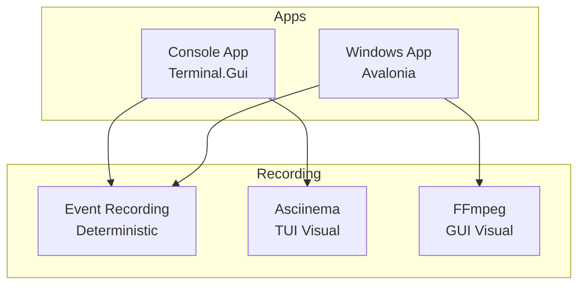

# RFC-052: Recording Service Contracts & Architecture

## Status: 📋 DRAFT

## Overview

This RFC defines the core contracts and architecture for PigeonPea's recording system, which supports both deterministic event-based recording and visual recording tailored to application type (TUI vs GUI).

## Motivation

As PigeonPea grows complex with dungeons, maps, ECS, and AI, we need robust recording for:

- **Debugging**: Reproduce bugs deterministically
- **Performance analysis**: Correlate events with profiling data (RFC-049)
- **Testing**: Use recordings as integration test fixtures
- **Comparison**: Diff different playthroughs programmatically
- **Demonstration**: Share gameplay visually

## Application Types

PigeonPea has two application types with different visual recording needs:

| Application     | UI Framework             | Event Recording | Visual Recording          |
| --------------- | ------------------------ | --------------- | ------------------------- |
| **Console App** | Terminal.Gui (TUI)       | ✅ Yes          | Asciinema (terminal text) |
| **Windows App** | Avalonia/SkiaSharp (GUI) | ✅ Yes          | FFmpeg (screen video)     |

## Architecture

### Recording Strategies



### Two-Layer Strategy

1. **Event Recording** (RFC-050 - All apps)
   - Records game logic events (player moves, entity spawns, etc.)
   - Deterministic replay with step-by-step debugging
   - Small file size (~2MB/hour)
   - Works identically in both TUI and GUI apps

2. **Visual Recording** (App-specific)
   - **Asciinema** (RFC-051 - TUI only): Terminal text output (~50MB/hour)
   - **FFmpeg** (RFC-052 - GUI only): Screen video capture (~500MB/hour)

## Proposed Contracts

### Core Interfaces

```csharp
namespace PigeonPea.Contracts.Recording.Services;

/// <summary>
/// Unified recording service interface
/// </summary>
public interface IService
{
    // Session management
    Task<string> StartRecordingAsync(
        RecordingType type,
        RecordingOptions options,
        CancellationToken ct = default);

    Task StopRecordingAsync(string sessionId, CancellationToken ct = default);
    bool IsRecording(string sessionId);
    IEnumerable<string> GetActiveSessions();

    // Playback (event recordings only)
    Task<RecordingMetadata> LoadRecordingAsync(string path, CancellationToken ct = default);
    Task PlayRecordingAsync(string path, PlaybackOptions options, CancellationToken ct = default);

    // Export
    Task ExportAsync(
        string sessionId,
        string outputPath,
        RecordingFormat format,
        CancellationToken ct = default);
}

/// <summary>
/// Event-specific recording interface
/// </summary>
public interface IEventRecorder
{
    void RecordEvent(GameEvent evt);
    void RecordState(string key, object value);
    IReadOnlyList<GameEvent> GetEvents();
    void EmbedProfilingData(string json);
}

/// <summary>
/// Visual recording interface (asciinema or ffmpeg)
/// </summary>
public interface IVisualRecorder
{
    Task StartAsync(string outputPath);
    Task StopAsync();
    bool IsRecording { get; }
}
```

### Models

```csharp
namespace PigeonPea.Contracts.Recording.Models;

public enum RecordingType
{
    Events,      // Deterministic game logic
    Visual       // Asciinema (TUI) or FFmpeg (GUI)
}

public enum RecordingFormat
{
    Json,        // Event recording
    Asciinema,   // .cast format (TUI)
    Mp4,         // Video (GUI)
    Webm         // Video alternative
}

public record RecordingSession
{
    public string Id { get; init; }
    public RecordingType Type { get; init; }
    public string OutputPath { get; init; }
    public DateTime StartTime { get; init; }
    public bool IsActive { get; init; }
    public Dictionary<string, object> Metadata { get; init; }
}

public record GameEvent
{
    public double Timestamp { get; init; }
    public string Type { get; init; }
    public string Category { get; init; }
    public Dictionary<string, object> Data { get; init; }
}

public record RecordingOptions
{
    public string OutputPath { get; init; }
    public bool EmbedProfiling { get; init; }
    public int? FrameRate { get; init; }  // For visual recording
    public Dictionary<string, object> CustomOptions { get; init; }
}

public record PlaybackOptions
{
    public double Speed { get; init; } = 1.0;
    public bool StepMode { get; init; }
    public Action<GameEvent>? OnEvent { get; init; }
}
```

## File Structure

```
dotnet/app-essential/core/src/
└── PigeonPea.Contracts.Recording/
    ├── Services/
    │   ├── IService.cs
    │   ├── IEventRecorder.cs
    │   └── IVisualRecorder.cs
    ├── Models/
    │   ├── RecordingSession.cs
    │   ├── RecordingType.cs
    │   ├── RecordingFormat.cs
    │   ├── GameEvent.cs
    │   ├── RecordingOptions.cs
    │   └── PlaybackOptions.cs
    └── PigeonPea.Contracts.Recording.csproj
```

## Integration Points

### With Profiling Service (RFC-049)

```csharp
// Embed profiling data in event recordings
var profiler = serviceProvider.GetService<IProfilingService>();
var eventRecorder = serviceProvider.GetService<IEventRecorder>();

profiler.OnRecordingStop += (sessionId) =>
{
    var profilingJson = profiler.ExportToJson();
    eventRecorder.EmbedProfilingData(profilingJson);
};
```

### With ECS Systems

```csharp
// Auto-record entity events
world.OnComponentAdded += (entity, component) =>
{
    if (recorder.IsRecording)
        recorder.RecordEvent(new GameEvent("ComponentAdd", entity, component));
};
```

### With Game Engine

```csharp
// Record player input
inputManager.OnKeyPress += (key) =>
{
    if (recorder.IsRecording)
        recorder.RecordEvent(new GameEvent("Input", new { key }));
};
```

## Implementation RFCs

This RFC defines only the **contracts and architecture**. Implementation is covered by:

- **RFC-053**: Event Recording Plugin (deterministic replay)
- **RFC-054**: Asciinema Recording Plugin (TUI visual)
- **RFC-055**: FFmpeg Recording Plugin (GUI visual)

## Design Principles

1. **Application-aware**: Different visual strategies per UI framework
2. **Pluggable**: Multiple recording strategies via plugins
3. **Lightweight**: Minimal overhead when not recording
4. **Deterministic**: Event recordings replay exactly
5. **Integratable**: Works with existing profiling service

## Usage Example

```csharp
var recorder = serviceProvider.GetService<IService>();

// TUI App: Record events + asciinema
var eventSession = await recorder.StartRecordingAsync(
    RecordingType.Events,
    new RecordingOptions { OutputPath = "session.json", EmbedProfiling = true });

var visualSession = await recorder.StartRecordingAsync(
    RecordingType.Visual,
    new RecordingOptions { OutputPath = "demo.cast" });

// ... play game ...

await recorder.StopRecordingAsync(eventSession);
await recorder.StopRecordingAsync(visualSession);

// Replay deterministically
await recorder.PlayRecordingAsync("session.json", new PlaybackOptions { Speed = 1.0 });
```

## Open Questions

> [!IMPORTANT]
> **API Design**: Should we use unified `IService` or separate interfaces (`IEventRecorder`, `IVisualRecorder`)?
>
> - Unified is simpler but less type-safe
> - Separate is more explicit but more interfaces to manage

> [!IMPORTANT]
> **Storage Location**: Default location for recordings?
>
> - Suggested: `recordings/events/` and `recordings/visual/`

## Verification Plan

1. Create contracts project
2. Verify interfaces compile
3. Create mock implementations
4. Test DI registration

## Conclusion

This RFC establishes lightweight, flexible contracts for PigeonPea's recording system, supporting both deterministic event replay and application-appropriate visual recording.

---

_Created: 2025-11-22_
_Status: Draft_
_Dependencies: None_
_Implements: N/A_
