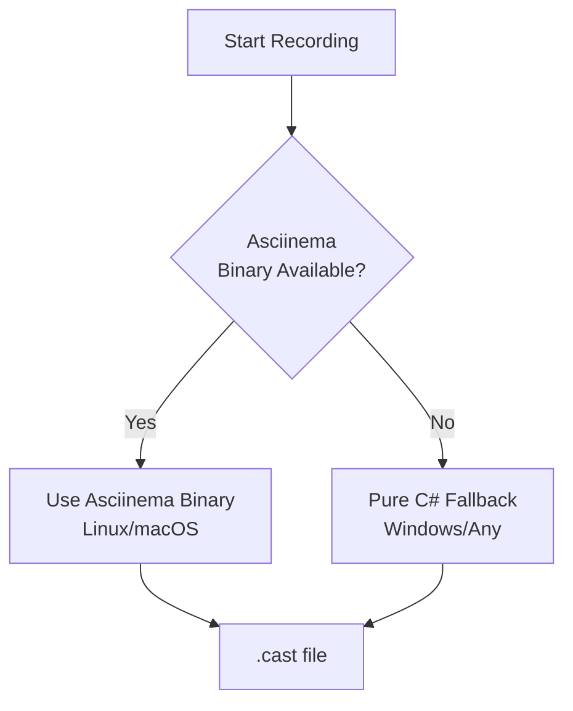

# RFC-054: Asciinema Recording Plugin for TUI Apps

## Status: 📋 DRAFT

## Overview

Implements terminal output recording for PigeonPea's **Terminal.Gui console applications** using asciinema format, with automatic fallback to pure C# implementation when asciinema binary is unavailable.

## Scope

**This plugin is for Console App (TUI) only**, not for the Avalonia GUI app.

| App Type                   | This Plugin | Alternative          |
| -------------------------- | ----------- | -------------------- |
| Console (Terminal.Gui TUI) | ✅ Yes      | N/A                  |
| Windows (Avalonia GUI)     | ❌ No       | Use RFC-055 (FFmpeg) |

## Motivation

### Why Asciinema for TUI?

Terminal.Gui renders text-based interfaces, making asciinema ideal:

- **Text-optimized**: ~50MB/hour vs ~500MB/hour for video
- **Shareable**: Upload to asciinema.org for web playback
- **Lightweight**: Captures terminal escape sequences efficiently
- **Portable**: .cast files are just JSON

### Use Cases

- **Bug reports**: Visual proof of rendering issues
- **Demos**: Showcase TUI gameplay
- **Documentation**: Interactive tutorials
- **Marketing**: Share on social media/websites

## Architecture

### Two-Strategy Approach



**Strategy 1: Asciinema Binary** (Preferred)

- Use native asciinema command (Linux/macOS)
- Full fidelity, tested implementation
- Automatic on platforms where available

**Strategy 2: Pure C# Fallback** (Windows/Universal)

- Capture Terminal.Gui buffer directly
- Export to asciinema v2 format
- Works everywhere, no dependencies

## Implementation

### File Structure

```
dotnet/app-essential/plugins/src/
└── PigeonPea.Plugins.Recording.Asciinema/
    ├── AsciinemaRecordingService.cs       # Main service with strategy selection
    ├── Strategies/
    │   ├── AscinemaBinaryRecorder.cs      # Strategy 1: Use binary
    │   └── TerminalBufferRecorder.cs      # Strategy 2: Pure C#
    ├── Exporters/
    │   └── AsciinemaExporter.cs           # Export to .cast format
    ├── Models/
    │   └── TerminalFrame.cs               # Frame data structure
    ├── Tests/
    │   └── AsciinemaRecordingTests.cs
    ├── plugin.json
    └── PigeonPea.Plugins.Recording.Asciinema.csproj
```

### AsciinemaRecordingService

```csharp
public class AsciinemaRecordingService : IVisualRecorder, IService
{
    private IRecordingStrategy _strategy;
    private readonly ILogger _logger;

    public AsciinemaRecordingService(ILogger logger)
    {
        _logger = logger;
        _strategy = SelectStrategy();
    }

    private IRecordingStrategy SelectStrategy()
    {
        // Try to use asciinema binary first
        if (AscinemaBinaryRecorder.IsAvailable())
        {
            _logger.LogInformation("Using asciinema binary for recording");
            return new AscinemaBinaryRecorder(_logger);
        }

        // Fallback to pure C# implementation
        _logger.LogInformation("Asciinema binary not found, using pure C# fallback");
        return new TerminalBufferRecorder(_logger);
    }

    public async Task StartAsync(string outputPath)
    {
        await _strategy.StartAsync(outputPath);
    }

    public async Task StopAsync()
    {
        await _strategy.StopAsync();
    }

    public bool IsRecording => _strategy.IsRecording;
}
```

### Strategy 1: AscinemaBinaryRecorder

```csharp
public class AscinemaBinaryRecorder : IRecordingStrategy
{
    private Process? _process;

    public static bool IsAvailable()
    {
        try
        {
            var result = Process.Start(new ProcessStartInfo
            {
                FileName = "asciinema",
                Arguments = "--version",
                RedirectStandardOutput = true,
                CreateNoWindow = true
            });
            result?.WaitForExit();
            return result?.ExitCode == 0;
        }
        catch
        {
            return false;
        }
    }

    public async Task StartAsync(string outputPath)
    {
        var psi = new ProcessStartInfo
        {
            FileName = "asciinema",
            Arguments = $"rec \"{outputPath}\"",
            UseShellExecute = false,
            RedirectStandardOutput = true,
            RedirectStandardError = true
        };

        _process = Process.Start(psi);
        _isRecording = true;
    }

    public async Task StopAsync()
    {
        if (_process != null && !_process.HasExited)
        {
            _process.Kill(entireProcessTree: true);
            await _process.WaitForExitAsync();
        }
        _isRecording = false;
    }
}
```

### Strategy 2: TerminalBufferRecorder

```csharp
public class TerminalBufferRecorder : IRecordingStrategy
{
    private readonly List<TerminalFrame> _frames = new();
    private readonly Stopwatch _stopwatch = new();
    private string? _outputPath;

    public async Task StartAsync(string outputPath)
    {
        _outputPath = outputPath;
        _frames.Clear();
        _stopwatch.Restart();

        // Hook into Terminal.Gui rendering
        Application.Iteration += CaptureFrame;
        _isRecording = true;
    }

    private void CaptureFrame()
    {
        var driver = Application.Driver;
        if (driver == null) return;

        var frame = new TerminalFrame
        {
            Timestamp = _stopwatch.Elapsed.TotalSeconds,
            Width = driver.Cols,
            Height = driver.Rows,
            Content = CaptureBuffer(driver)
        };

        // Only store frames that are different from previous
        if (_frames.Count == 0 || !FramesEqual(_frames.Last(), frame))
        {
            _frames.Add(frame);
        }
    }

    private string CaptureBuffer(ConsoleDriver driver)
    {
        var sb = new StringBuilder();
        for (int row = 0; row < driver.Rows; row++)
        {
            for (int col = 0; col < driver.Cols; col++)
            {
                var cell = driver.Contents[row, col];
                sb.Append(cell.Rune);
                // TODO: Capture color/attributes as ANSI escape codes
            }
        }
        return sb.ToString();
    }

    public async Task StopAsync()
    {
        Application.Iteration -= CaptureFrame;
        _stopwatch.Stop();
        _isRecording = false;

        // Export to asciinema format
        var exporter = new AsciinemaExporter();
        await exporter.ExportAsync(_frames, _outputPath!);
    }
}
```

### Asciinema v2 Format Exporter

```csharp
public class AsciinemaExporter
{
    public async Task ExportAsync(List<TerminalFrame> frames, string outputPath)
    {
        using var writer = new StreamWriter(outputPath);

        // Header (JSON line 1)
        var header = new
        {
            version = 2,
            width = frames[0].Width,
            height = frames[0].Height,
            timestamp = DateTimeOffset.UtcNow.ToUnixTimeSeconds(),
            env = new { TERM = "xterm-256color", SHELL = "/bin/bash" }
        };
        await writer.WriteLineAsync(JsonSerializer.Serialize(header));

        // Events (JSON array per line)
        foreach (var frame in frames)
        {
            var eventData = new object[]
            {
                frame.Timestamp,
                "o",  // output
                frame.Content
            };
            await writer.WriteLineAsync(JsonSerializer.Serialize(eventData));
        }
    }
}
```

## Asciinema v2 Format

The `.cast` format is simple JSON:

```json
{"version": 2, "width": 80, "height": 24, "timestamp": 1700000000}
[0.0, "o", "Hello World"]
[1.0, "o", "\u001b[2J\u001b[H"]
[2.5, "o", "Game frame"]
```

Each line after the header is: `[timestamp, event_type, data]`

- `timestamp`: Seconds since recording started
- `event_type`: `"o"` for output, `"i"` for input
- `data`: String content (with ANSI escape codes)

## Usage Examples

### Basic Recording

```csharp
var recorder = serviceProvider.GetService<IVisualRecorder>();

// Start recording
await recorder.StartAsync("recordings/demo.cast");

// Run TUI app
Application.Run();

// Stop recording
await recorder.StopAsync();

// Upload to asciinema.org for sharing
// > asciinema upload recordings/demo.cast
```

### With Event Recording

```csharp
// Record both events (deterministic) and visual (demo)
var eventRecorder = serviceProvider.GetService<IEventRecorder>();
var visualRecorder = serviceProvider.GetService<IVisualRecorder>();

await Task.WhenAll(
    Task.Run(() => eventRecorder.StartRecording(seed: 12345)),
    visualRecorder.StartAsync("demo.cast")
);

// Play game...

await Task.WhenAll(
    eventRecorder.SaveAsync("session.json"),
    visualRecorder.StopAsync()
);

// Now you have:
// - session.json: Deterministic replay
// - demo.cast: Visual demonstration
```

## Integration with Terminal.Gui

The pure C# fallback hooks into Terminal.Gui's render loop:

```csharp
// In your main app initialization
var asciinemaRecorder = new AsciinemaRecordingService(logger);

// Start recording before running app
await asciinemaRecorder.StartAsync("gameplay.cast");

// Run Terminal.Gui app normally
Application.Init();
var top = Application.Top;
// ... setup UI ...
Application.Run(top);

// Stop recording after app closes
await asciinemaRecorder.StopAsync();
Application.Shutdown();
```

## Performance Characteristics

| Metric        | Asciinema Binary           | Pure C# Fallback         |
| ------------- | -------------------------- | ------------------------ |
| CPU overhead  | Minimal (external process) | ~1-2% (buffer capture)   |
| Memory        | ~10MB                      | ~5MB (in-memory frames)  |
| File size     | ~50MB/hour                 | ~50MB/hour               |
| Frame capture | Full fidelity              | Terminal.Gui buffer only |

## Verification Plan

### Unit Tests

```csharp
[TestClass]
public class AsciinemaRecordingTests
{
    [TestMethod]
    public void TestStrategySelection_BinaryAvailable()
    {
        // If asciinema is installed, should select binary strategy
    }

    [TestMethod]
    public void TestStrategySelection_BinaryNotAvailable()
    {
        // Should fallback to pure C# implementation
    }

    [TestMethod]
    public void TestAsciinemaExport_ValidFormat()
    {
        // Export frames and verify .cast format is valid
    }
}
```

### Manual Testing

1. **With asciinema binary** (Linux/macOS):
   - Record TUI session
   - Verify .cast file created
   - Upload to asciinema.org
   - Verify playback works

2. **Without asciinema binary** (Windows):
   - Record TUI session
   - Verify pure C# fallback used
   - Upload to asciinema.org
   - Verify playback works

3. **Comparison**:
   - Record same session with both strategies
   - Compare output quality

## Limitations

### Pure C# Fallback Limitations

- **Color fidelity**: May not capture all ANSI colors perfectly
- **Complex escape sequences**: Some advanced VT sequences might be missed
- **Performance**: Slightly higher CPU usage than external binary

### General Limitations

- **TUI only**: Does not work for Avalonia GUI app
- **File size**: Larger than event recordings (~25x)
- **Playback**: Requires asciinema player or web viewer

## Open Questions

> [!IMPORTANT]
> **Frame rate**: Should we capture every frame or only when content changes? Current implementation captures on change to save space.

> [!IMPORTANT]
> **Color encoding**: How to best capture Terminal.Gui colors as ANSI escape codes in pure C# fallback?

## Conclusion

The asciinema plugin provides high-quality visual recording for Terminal.Gui console apps with automatic platform-appropriate strategy selection, enabling easy sharing and demonstration of TUI gameplay.

---

_Created: 2025-11-22_
_Status: Draft_
_Dependencies: RFC-00052_
_Implements: RFC-00052_
