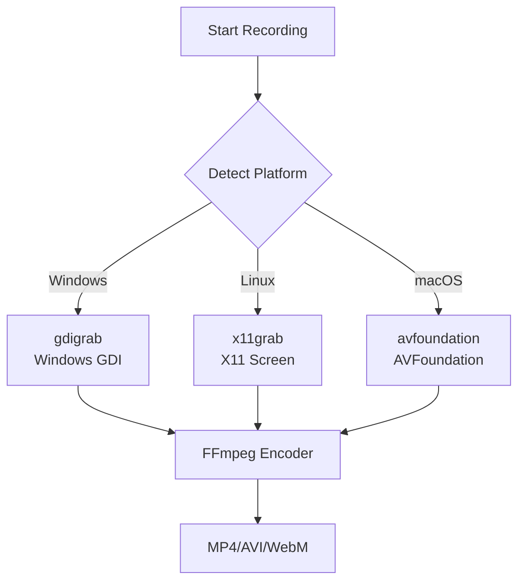

# RFC-055: FFmpeg Recording Plugin for GUI Apps

## Status: 📋 DRAFT

## Overview

Implements screen/video recording for PigeonPea's **Avalonia GUI applications** using FFmpeg for high-quality video capture with cross-platform support.

## Scope

**This plugin is for Windows App (GUI) only**, not for the Terminal.Gui console app.

| App Type                   | This Plugin | Alternative             |
| -------------------------- | ----------- | ----------------------- |
| Console (Terminal.Gui TUI) | ❌ No       | Use RFC-054 (Asciinema) |
| Windows (Avalonia GUI)     | ✅ Yes      | N/A                     |

## Motivation

### Why FFmpeg for GUI?

Avalonia renders graphical interfaces with SkiaSharp, requiring video capture:

- **Visual fidelity**: Captures exact screen/window rendering
- **Standard format**: MP4/AVI/WebM playable anywhere
- **Cross-platform**: Works on Windows, Linux, macOS with FFmpeg
- **Marketing ready**: High-quality videos for demos/tutorials

### Use Cases

- **Bug reports**: Visual proof of rendering/UI glitches
- **Marketing**: Showcase GUI gameplay for portfolios/trailers
- **Tutorials**: Create video guides
- **User testing**: Record user sessions for UX analysis

## Architecture

### Platform-Specific Screen Capture



**Platform Capture Methods**:

- **Windows**: `gdigrab` (Windows GDI screen capture)
- **Linux**: `x11grab` (X11 screen capture)
- **macOS**: `avfoundation` (AVFoundation framework)

## Implementation

### File Structure

```
dotnet/app-essential/plugins/src/
└── PigeonPea.Plugins.Recording.FFmpeg/
    ├── FFmpegRecordingService.cs          # Main service
    ├── PlatformCapture/
    │   ├── WindowsCaptureStrategy.cs      # gdigrab for Windows
    │   ├── LinuxCaptureStrategy.cs        # x11grab for Linux
    │   └── MacOSCaptureStrategy.cs        # avfoundation for macOS
    ├── Configuration/
    │   └── FFmpegRecordingOptions.cs      # Recording settings
    ├── Exporters/
    │   └── VideoExporter.cs               # Format exporters
    ├── Tests/
    │   └── FFmpegRecordingTests.cs
    ├── plugin.json
    └── PigeonPea.Plugins.Recording.FFmpeg.csproj
```

### FFmpegRecordingService

```csharp
public class FFmpegRecordingService : IVisualRecorder, IService, IDisposable
{
    private readonly ILogger _logger;
    private readonly FFmpegRecordingOptions _options;
    private Process? _ffmpegProcess;
    private ICaptureStrategy _strategy;
    private bool _isRecording;

    public FFmpegRecordingService(ILogger logger, FFmpegRecordingOptions? options = null)
    {
        _logger = logger;
        _options = options ?? new FFmpegRecordingOptions();
        _strategy = SelectCaptureStrategy();
    }

    private ICaptureStrategy SelectCaptureStrategy()
    {
        if (RuntimeInformation.IsOSPlatform(OSPlatform.Windows))
            return new WindowsCaptureStrategy(_options);
        if (RuntimeInformation.IsOSPlatform(OSPlatform.Linux))
            return new LinuxCaptureStrategy(_options);
        if (RuntimeInformation.IsOSPlatform(OSPlatform.OSX))
            return new MacOSCaptureStrategy(_options);

        throw new PlatformNotSupportedException("Video recording not supported on this platform");
    }

    public async Task StartAsync(string outputPath)
    {
        if (!IsFFmpegAvailable())
        {
            throw new InvalidOperationException("FFmpeg is not installed or not available in PATH");
        }

        if (_isRecording)
        {
            throw new InvalidOperationException("Recording is already in progress");
        }

        ValidateOutputPath(outputPath);

        var args = _strategy.BuildFFmpegArgs(outputPath);

        var psi = new ProcessStartInfo
        {
            FileName = "ffmpeg",
            Arguments = args,
            UseShellExecute = false,
            RedirectStandardInput = true,
            RedirectStandardOutput = !_options.ShowFFmpegOutput,
            RedirectStandardError = !_options.ShowFFmpegOutput,
            CreateNoWindow = !_options.ShowFFmpegOutput
        };

        _ffmpegProcess = Process.Start(psi);
        _isRecording = true;

        _logger.LogInformation("Started FFmpeg recording to {Path}", outputPath);
    }

    public async Task StopAsync()
    {
        if (_ffmpegProcess != null && !_ffmpegProcess.HasExited)
        {
            // Send 'q' to gracefully stop FFmpeg
            try
            {
                await _ffmpegProcess.StandardInput.WriteLineAsync("q");
                await _ffmpegProcess.StandardInput.FlushAsync();

                if (!_ffmpegProcess.WaitForExit(5000))
                {
                    _ffmpegProcess.Kill(entireProcessTree: true);
                }
            }
            catch
            {
                _ffmpegProcess.Kill(entireProcessTree: true);
            }

            await _ffmpegProcess.WaitForExitAsync();
        }

        _isRecording = false;
        _logger.LogInformation("Stopped FFmpeg recording");
    }

    public void Dispose()
    {
        if (_isRecording && _ffmpegProcess != null && !_ffmpegProcess.HasExited)
        {
            try
            {
                _ffmpegProcess.Kill(entireProcessTree: true);
                _ffmpegProcess.WaitForExit();
            }
            catch (Exception ex)
            {
                _logger.LogWarning(ex, "Failed to cleanup FFmpeg process during disposal");
            }
        }

        _ffmpegProcess?.Dispose();
        _isRecording = false;
    }
}
```

### Platform Strategies

#### Windows (gdigrab)

```csharp
public class WindowsCaptureStrategy : ICaptureStrategy
{
    private readonly FFmpegRecordingOptions _options;

    public WindowsCaptureStrategy(FFmpegRecordingOptions options)
    {
        _options = options;
    }

    public string BuildFFmpegArgs(string outputPath)
    {
        var args = new List<string>
        {
            "-f", "gdigrab",
            "-framerate", _options.FrameRate.ToString(),
            "-i", _options.CaptureDesktop ? "desktop" : $"title={_options.WindowTitle}"
        };

        if (_options.OffsetX.HasValue && _options.OffsetY.HasValue)
        {
            args.AddRange(new[]
            {
                "-offset_x", _options.OffsetX.Value.ToString(),
                "-offset_y", _options.OffsetY.Value.ToString()
            });
        }

        if (!_options.ShowCursor)
        {
            args.AddRange(new[] { "-draw_mouse", "0" });
        }

        AddEncodingOptions(args);
        args.Add($"\"{outputPath}\"");

        return string.Join(" ", args);
    }
}
```

#### Linux (x11grab)

```csharp
public class LinuxCaptureStrategy : ICaptureStrategy
{
    private readonly FFmpegRecordingOptions _options;

    public LinuxCaptureStrategy(FFmpegRecordingOptions options)
    {
        _options = options;
    }

    public string BuildFFmpegArgs(string outputPath)
    {
        var args = new List<string>
        {
            "-f", "x11grab",
            "-framerate", _options.FrameRate.ToString(),
            "-video_size", _options.Resolution ?? "1920x1080",
            "-i", _options.Display ?? ":0.0"
        };

        if (_options.FollowMouse)
        {
            args.AddRange(new[] { "-follow_mouse", "centered" });
        }

        if (!_options.ShowCursor)
        {
            args.AddRange(new[] { "-draw_mouse", "0" });
        }

        AddEncodingOptions(args);
        args.Add($"\"{outputPath}\"");

        return string.Join(" ", args);
    }
}
```

#### macOS (avfoundation)

```csharp
public class MacOSCaptureStrategy : ICaptureStrategy
{
    private readonly FFmpegRecordingOptions _options;

    public MacOSCaptureStrategy(FFmpegRecordingOptions options)
    {
        _options = options;
    }

    public string BuildFFmpegArgs(string outputPath)
    {
        var args = new List<string>
        {
            "-f", "avfoundation",
            "-framerate", _options.FrameRate.ToString(),
            "-i", _options.ScreenDevice.ToString() // "1" for main screen
        };

        if (_options.CaptureMouse)
        {
            args.AddRange(new[] { "-capture_cursor", "1" });
        }

        if (_options.CaptureClicks)
        {
            args.AddRange(new[] { "-capture_mouse_clicks", "1" });
        }

        AddEncodingOptions(args);
        args.Add($"\"{outputPath}\"");

        return string.Join(" ", args);
    }
}
```

### Interface Definitions

The plugin implements the following interfaces defined in RFC-00052:

```csharp
// From RFC-00052: Recording Plugin Infrastructure
public interface IVisualRecorder
{
    Task StartAsync(string outputPath);
    Task StopAsync();
}

public interface ICaptureStrategy
{
    string BuildFFmpegArgs(string outputPath);
}
```

### Encoding Options

Each platform strategy includes its own `AddEncodingOptions` method:

```csharp
private void AddEncodingOptions(List<string> args)
{
    args.AddRange(new[]
    {
        "-c:v", _options.VideoCodec,      // Default: libx264
        "-preset", _options.Preset,        // Default: medium
        "-crf", _options.CRF.ToString(),  // Default: 23 (quality)
        "-pix_fmt", _options.PixelFormat  // Default: yuv420p
    });

    if (_options.MaxDuration.HasValue)
    {
        args.AddRange(new[] { "-t", _options.MaxDuration.Value.ToString() });
    }

    if (_options.CustomArgs?.Length > 0)
    {
        args.AddRange(_options.CustomArgs);
    }
}
```

### Error Handling and Validation

The plugin includes comprehensive error handling:

```csharp
// FFmpeg availability check (called before recording)
public bool IsFFmpegAvailable()
{
    try
    {
        var result = Process.Start(new ProcessStartInfo
        {
            FileName = "ffmpeg",
            Arguments = "-version",
            RedirectStandardOutput = true,
            CreateNoWindow = true
        });
        result?.WaitForExit();
        return result?.ExitCode == 0;
    }
    catch
    {
        return false;
    }
}

// Output path validation
private void ValidateOutputPath(string outputPath)
{
    if (string.IsNullOrWhiteSpace(outputPath))
        throw new ArgumentException("Output path cannot be empty", nameof(outputPath));

    var directory = Path.GetDirectoryName(outputPath);
    if (!string.IsNullOrEmpty(directory) && !Directory.Exists(directory))
        Directory.CreateDirectory(directory);
}
```

**Error scenarios handled**:

- FFmpeg not installed or not in PATH
- Recording already in progress
- Output directory doesn't exist (auto-created)
- Process cleanup on disposal or application exit
- FFmpeg process failures (timeout, crashes)

### Configuration Options

```csharp
public class FFmpegRecordingOptions
{
    // Capture settings
    public int FrameRate { get; set; } = 30;
    public string? Resolution { get; set; }  // e.g., "1920x1080"
    public bool ShowCursor { get; set; } = true;

    // Windows-specific
    public bool CaptureDesktop { get; set; } = true;
    public string? WindowTitle { get; set; }
    public int? OffsetX { get; set; }
    public int? OffsetY { get; set; }

    // Linux-specific
    public string? Display { get; set; } = ":0.0";
    public bool FollowMouse { get; set; } = false;

    // macOS-specific
    public int ScreenDevice { get; set; } = 1;
    public bool CaptureMouse { get; set; } = true;
    public bool CaptureClicks { get; set; } = false;

    // Encoding settings
    public string VideoCodec { get; set; } = "libx264";
    public string Preset { get; set; } = "medium";  // ultrafast, fast, medium, slow
    public int CRF { get; set; } = 23;  // 0-51, lower = better quality
    public string PixelFormat { get; set; } = "yuv420p";

    // Output settings
    public int? MaxDuration { get; set; }  // Seconds
    public bool ShowFFmpegOutput { get; set; } = false;
    public string[]? CustomArgs { get; set; }
}
```

## Usage Examples

### Basic Recording

```csharp
var recorder = serviceProvider.GetService<IVisualRecorder>();

// Start recording desktop
await recorder.StartAsync("recordings/gameplay.mp4");

// Run Avalonia app
var app = new App();
app.Run();

// Stop recording
await recorder.StopAsync();
```

### With Custom Options

```csharp
var options = new FFmpegRecordingOptions
{
    FrameRate = 60,
    Resolution = "1920x1080",
    VideoCodec = "libx264",
    Preset = "fast",
    CRF = 18,  // Higher quality
    ShowCursor = true,
    MaxDuration = 300  // 5 minutes max
};

var recorder = new FFmpegRecordingService(logger, options);
await recorder.StartAsync("demo.mp4");
```

### Record Specific Window (Windows)

```csharp
var options = new FFmpegRecordingOptions
{
    CaptureDesktop = false,
    WindowTitle = "PigeonPea - Game Window",
    FrameRate = 30
};

var recorder = new FFmpegRecordingService(logger, options);
await recorder.StartAsync("window-capture.mp4");
```

## Performance Characteristics

| Setting                    | CPU Usage | File Size  | Quality |
| -------------------------- | --------- | ---------- | ------- |
| Preset: ultrafast, CRF: 28 | ~5%       | ~100MB/min | Low     |
| Preset: medium, CRF: 23    | ~15%      | ~50MB/min  | Medium  |
| Preset: slow, CRF: 18      | ~30%      | ~80MB/min  | High    |

**Recommendations**:

- **Development/debugging**: ultrafast, CRF 28
- **Marketing/demos**: medium, CRF 23
- **High quality**: slow, CRF 18

## Verification Plan

### Unit Tests

```csharp
[TestClass]
public class FFmpegRecordingTests
{
    [TestMethod]
    public void TestPlatformStrategySelection_Windows()
    {
        // Verify Windows uses gdigrab
    }

    [TestMethod]
    public void TestFFmpegArgsBuilding_Windows()
    {
        var strategy = new WindowsCaptureStrategy(defaultOptions);
        var args = strategy.BuildFFmpegArgs("output.mp4");
        Assert.IsTrue(args.Contains("-f gdigrab"));
    }
}
```

### Manual Testing

1. **Windows**: Record desktop, verify MP4 created and playable
2. **Linux**: Record X11 screen, verify quality
3. **macOS**: Record with AVFoundation, test mouse capture
4. **All platforms**: Test different presets and CRF values

## Requirements

### FFmpeg Installation

Users must have FFmpeg installed:

**Windows**:

```powershell
winget install ffmpeg
# or
choco install ffmpeg
```

**Linux**:

```bash
sudo apt install ffmpeg  # Debian/Ubuntu
sudo dnf install ffmpeg  # Fedora
```

**macOS**:

```bash
brew install ffmpeg
```

The plugin automatically detects if FFmpeg is available:

```csharp
public static bool IsFFmpegAvailable()
{
    try
    {
        var result = Process.Start(new ProcessStartInfo
        {
            FileName = "ffmpeg",
            Arguments = "-version",
            RedirectStandardOutput = true,
            CreateNoWindow = true
        });
        result?.WaitForExit();
        return result?.ExitCode == 0;
    }
    catch
    {
        return false;
    }
}
```

## Limitations

- **FFmpeg required**: External dependency (not pure C#)
- **Large files**: ~50MB/minute (vs ~1MB/minute for asciinema)
- **CPU intensive**: 5-30% CPU depending on settings
- **GUI only**: Does not work for TUI apps (use RFC-054)

## Open Questions

> [!IMPORTANT]
> **Audio recording**: Should we support audio capture? If yes, how to configure microphone/system audio per platform?

> [!IMPORTANT]
> **GPU encoding**: Should we support hardware encoding (NVENC, QuickSync, etc.) for better performance?

## Conclusion

The FFmpeg plugin provides high-quality video recording for Avalonia GUI applications with cross-platform support and configurable quality/performance tradeoffs.

---

_Created: 2025-11-22_
_Status: Draft_
_Dependencies: RFC-00052_
_Implements: RFC-00052_
_Reference: Port from ref-projects/hyacinth-bean-base FFmpeg plugin_
