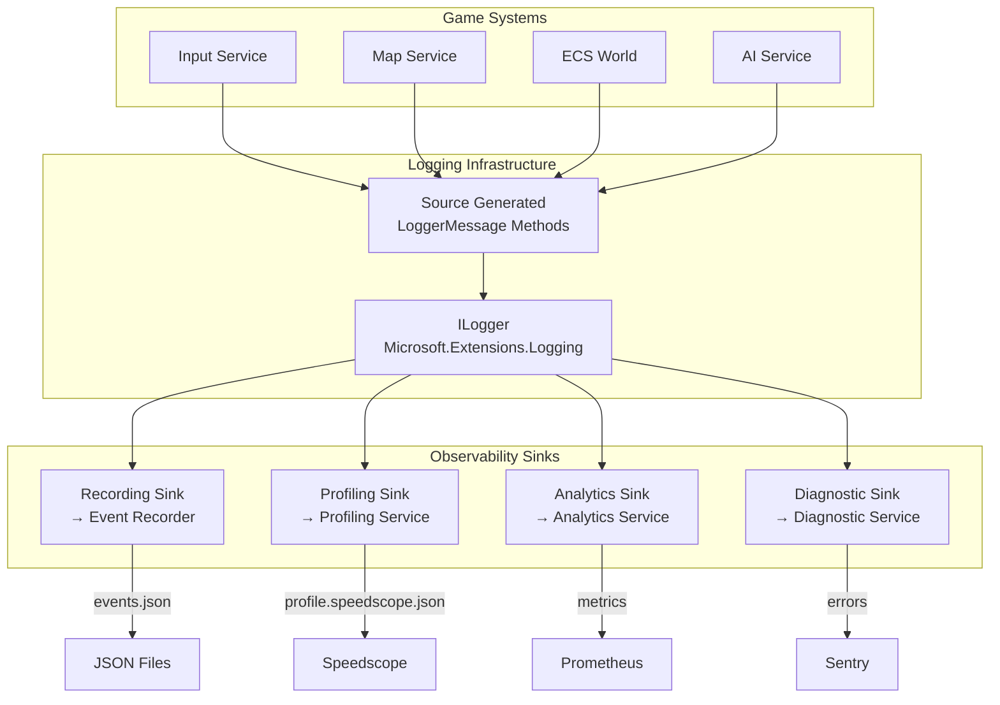

# RFC-056: Unified Observability Through ILogger Integration

## Status: ✅ IMPLEMENTED

**Implementation Complete**: All logging infrastructure is implemented and ready for adoption.
**Next Step**: Game systems need to migrate from direct service calls to unified logging.

---

## Implementation Status

### ✅ Completed Infrastructure

All core components have been implemented:

| Component           | Status      | Location                               |
| ------------------- | ----------- | -------------------------------------- |
| **GameEventLog**    | ✅ Complete | `PigeonPea.Logging/GameEventLog.cs`    |
| **Recording Sink**  | ✅ Complete | `PigeonPea.Plugins.Logging.Recording`  |
| **Analytics Sink**  | ✅ Complete | `PigeonPea.Plugins.Logging.Analytics`  |
| **Profiling Sink**  | ✅ Complete | `PigeonPea.Plugins.Logging.Profiling`  |
| **Diagnostic Sink** | ✅ Complete | `PigeonPea.Plugins.Logging.Diagnostic` |

### 🔄 Migration Needed

**Current State**: Game systems still inject multiple services directly
**Target State**: Game systems use only `ILogger` with unified logging methods

**Progress**: Infrastructure ready, adoption pending

---

## Overview

This RFC proposes unifying all observability services (Recording, Analytics, Profiling, Diagnostic) through a single `ILogger` interface using source generators, eliminating the need for game systems to directly depend on multiple services.

## Motivation

### Current Problem

Game systems must inject and call multiple services:

```csharp
public class InputService
{
    private readonly IEventRecorder _recorder;
    private readonly IAnalyticsService _analytics;
    private readonly IProfilingService _profiler;
    private readonly ILogger _logger;

    public void HandleKeyPress(KeyPress key)
    {
        // 4 separate calls for the same event!
        _recorder.RecordEvent(new GameEvent("KeyPress", "Input", new { key }));
        _analytics.TrackEvent("KeyPress", new { key });
        _profiler.RecordMarker("KeyPress");
        _logger.LogInformation("Key pressed: {Key}", key);

        ProcessInput(key);
    }
}
```

**Problems:**

- ❌ **Tight coupling**: 4 service dependencies
- ❌ **Error-prone**: Easy to forget one service
- ❌ **Code duplication**: Same data passed 4 times
- ❌ **Performance**: 4 method calls per event
- ❌ **Maintainability**: Adding a service = update all callers

### Proposed Solution

**Single ILogger call, multiple sinks:**

```csharp
public class InputService
{
    private readonly ILogger<InputService> _logger;

    public void HandleKeyPress(KeyPress key)
    {
        // One call, all services notified!
        _logger.LogPlayerInput(key);  // ← Source-generated

        ProcessInput(key);
    }
}
```

**Benefits:**

- ✅ **Loose coupling**: Only `ILogger` dependency
- ✅ **Impossible to forget**: Single call point
- ✅ **DRY**: Data specified once
- ✅ **Performance**: Source generators = zero overhead
- ✅ **Maintainable**: Add sinks without changing callers
- ✅ **Implemented**: All infrastructure exists and is ready for use

## Architecture

### High-Level Flow



### Component Responsibilities

| Component             | Responsibility                                            |
| --------------------- | --------------------------------------------------------- |
| **Game Systems**      | Call `logger.LogEventName()` when important things happen |
| **Source Generators** | Generate high-performance logging methods at compile time |
| **ILogger**           | Route log entries to all registered providers/sinks       |
| **Recording Sink**    | Convert logs → `GameEvent` → Event Recorder               |
| **Profiling Sink**    | Extract timing info → Profiling Service                   |
| **Analytics Sink**    | Convert logs → metrics → Analytics Service                |
| **Diagnostic Sink**   | Filter errors/warnings → Diagnostic Service               |

## Implementation

### 1. Define Structured Logging Methods

> **✅ IMPLEMENTED**: See `PigeonPea.Logging/GameEventLog.cs`

The implementation includes **50+ logging methods** across all categories:

- **Player Events** (1000-1999): Move, Attack, Damage, Heal, Death, Respawn
- **Entity Events** (2000-2999): Spawn, ComponentAdd/Remove, Destroy
- **Map Events** (3000-3999): GenerationStart/Complete, TileModified
- **AI Events** (4000-4999): Decision, StateChange, PathCalculated
- **Performance Events** (5000-5999): SlowFrame, SlowSystemUpdate, GarbageCollection
- **Input Events** (6000-6999): KeyInput, MouseInput, GamepadInput
- **Audio Events** (7000-7999): SoundPlayed, MusicChanged
- **Network Events** (8000-8999): Connected, Disconnected, PacketSent
- **Error Events** (9000-9999): GameError, ValidationError, ConfigurationError
- **System Events** (10000-10999): GameStarted, Shutdown, PluginLoaded/Unloaded

```csharp
// Example: Player move logging (already implemented)
[LoggerMessage(
    EventId = 1001,
    Level = LogLevel.Information,
    Message = "Player moved from {FromX},{FromY} to {ToX},{ToY}")]
public static partial void LogPlayerMove(
    this ILogger logger,
    int fromX, int fromY,
    int toX, int toY);
```

```csharp
using Microsoft.Extensions.Logging;

namespace PigeonPea.Logging;

/// <summary>
/// Game event logging methods - source-generated for zero overhead
/// </summary>
public static partial class GameEventLog
{
    // Player Events
    [LoggerMessage(
        EventId = 1001,
        Level = LogLevel.Information,
        Message = "Player moved from {FromX},{FromY} to {ToX},{ToY}")]
    public static partial void LogPlayerMove(
        this ILogger logger,
        int fromX, int fromY,
        int toX, int toY);

    [LoggerMessage(
        EventId = 1002,
        Level = LogLevel.Information,
        Message = "Player attacked {Target}")]
    public static partial void LogPlayerAttack(
        this ILogger logger,
        string target);

    // Entity Events
    [LoggerMessage(
        EventId = 2001,
        Level = LogLevel.Information,
        Message = "Entity {EntityId} spawned at {X},{Y} with {ComponentCount} components")]
    public static partial void LogEntitySpawned(
        this ILogger logger,
        string entityId,
        int x, int y,
        int componentCount);

    [LoggerMessage(
        EventId = 2002,
        Level = LogLevel.Information,
        Message = "Component {ComponentType} added to entity {EntityId}")]
    public static partial void LogComponentAdded(
        this ILogger logger,
        string componentType,
        string entityId);

    // Map Events
    [LoggerMessage(
        EventId = 3001,
        Level = LogLevel.Information,
        Message = "Map generation started with seed {Seed}")]
    public static partial void LogMapGenerationStart(
        this ILogger logger,
        int seed);

    [LoggerMessage(
        EventId = 3002,
        Level = LogLevel.Information,
        Message = "Map generation completed: {TileCount} tiles, {RiverCount} rivers")]
    public static partial void LogMapGenerationComplete(
        this ILogger logger,
        int tileCount,
        int riverCount);

    // AI Events
    [LoggerMessage(
        EventId = 4001,
        Level = LogLevel.Information,
        Message = "AI {EntityId} decided {Decision} with score {Score}")]
    public static partial void LogAIDecision(
        this ILogger logger,
        string entityId,
        string decision,
        double score);

    // Performance Events
    [LoggerMessage(
        EventId = 5001,
        Level = LogLevel.Warning,
        Message = "Frame took {FrameTimeMs}ms (target: 16.67ms)")]
    public static partial void LogSlowFrame(
        this ILogger logger,
        double frameTimeMs);

    // Error Events
    [LoggerMessage(
        EventId = 9001,
        Level = LogLevel.Error,
        Message = "Game error in {System}: {ErrorMessage}")]
    public static partial void LogGameError(
        this ILogger logger,
        string system,
        string errorMessage,
        Exception? exception);
}
```

### 2. Implement Recording Logger Sink

> **✅ IMPLEMENTED**: See `PigeonPea.Plugins.Logging.Recording/`

**Enhanced Features** (beyond RFC proposal):

- ✅ **Configuration options**: `RecordingLoggerOptions` with filtering
- ✅ **Category filtering**: Selective logging by category
- ✅ **Enhanced data extraction**: Multiple state formats supported
- ✅ **Exception handling**: Full exception details captured
- ✅ **EventId ranges**: Extended to include Input, Audio, Network, System categories

```csharp
// Actual implementation is more sophisticated than RFC proposal
public class RecordingLogger : ILogger
{
    private readonly RecordingLoggerOptions _options;

    // Supports category filtering, minimum levels, enhanced data extraction
    // See full implementation in RecordingLogger.cs
}
```

```csharp
using Microsoft.Extensions.Logging;
using PigeonPea.Contracts.Recording.Services;

namespace PigeonPea.Plugins.Logging.Recording;

public class RecordingLoggerProvider : ILoggerProvider
{
    private readonly IEventRecorder _recorder;

    public RecordingLoggerProvider(IEventRecorder recorder)
    {
        _recorder = recorder;
    }

    public ILogger CreateLogger(string categoryName)
    {
        return new RecordingLogger(_recorder, categoryName);
    }

    public void Dispose() { }
}

public class RecordingLogger : ILogger
{
    private readonly IEventRecorder _recorder;
    private readonly string _category;

    public RecordingLogger(IEventRecorder recorder, string category)
    {
        _recorder = recorder;
        _category = category;
    }

    public IDisposable? BeginScope<TState>(TState state) where TState : notnull
        => null;

    public bool IsEnabled(LogLevel logLevel)
        => _recorder.IsRecording;

    public void Log<TState>(
        LogLevel logLevel,
        EventId eventId,
        TState state,
        Exception? exception,
        Func<TState, Exception?, string> formatter)
    {
        if (!_recorder.IsRecording)
            return;

        // Extract structured data from state
        var data = ExtractData(state);

        // Create GameEvent
        var gameEvent = new GameEvent
        {
            Timestamp = 0, // Will be set by EventRecorder
            Type = eventId.Name ?? $"Event{eventId.Id}",
            Category = DetermineCategoryFromEventId(eventId.Id),
            Data = data
        };

        _recorder.RecordEvent(gameEvent);
    }

    private Dictionary<string, object> ExtractData<TState>(TState state)
    {
        var data = new Dictionary<string, object>();

        // Extract from IReadOnlyList<KeyValuePair<string, object>>
        if (state is IReadOnlyList<KeyValuePair<string, object>> kvps)
        {
            foreach (var kvp in kvps)
            {
                if (kvp.Key != "{OriginalFormat}")
                    data[kvp.Key] = kvp.Value;
            }
        }

        return data;
    }

    private string DetermineCategoryFromEventId(int eventId)
    {
        return eventId switch
        {
            >= 1000 and < 2000 => "Player",
            >= 2000 and < 3000 => "Entity",
            >= 3000 and < 4000 => "Map",
            >= 4000 and < 5000 => "AI",
            >= 5000 and < 6000 => "Performance",
            >= 9000 => "Error",
            _ => "General"
        };
    }
}

// Extension methods for registration
public static class RecordingLoggerExtensions
{
    public static ILoggingBuilder AddRecordingSink(this ILoggingBuilder builder)
    {
        builder.Services.AddSingleton<ILoggerProvider, RecordingLoggerProvider>();
        return builder;
    }
}
```

### 3. Implement Analytics Logger Sink

> **✅ IMPLEMENTED**: See `PigeonPea.Plugins.Logging.Analytics/`

**Features**:

- ✅ Event tracking with structured properties
- ✅ Metric tracking for performance events
- ✅ Counter increment by category
- ✅ Conditional processing based on service state

```csharp
using Microsoft.Extensions.Logging;
using PigeonPea.Contracts.Analytics.Services;

namespace PigeonPea.Plugins.Logging.Analytics;

public class AnalyticsLoggerProvider : ILoggerProvider
{
    private readonly IAnalyticsService _analytics;

    public AnalyticsLoggerProvider(IAnalyticsService analytics)
    {
        _analytics = analytics;
    }

    public ILogger CreateLogger(string categoryName)
    {
        return new AnalyticsLogger(_analytics, categoryName);
    }

    public void Dispose() { }
}

public class AnalyticsLogger : ILogger
{
    private readonly IAnalyticsService _analytics;
    private readonly string _category;

    public AnalyticsLogger(IAnalyticsService analytics, string category)
    {
        _analytics = analytics;
        _category = category;
    }

    public IDisposable? BeginScope<TState>(TState state) where TState : notnull
        => null;

    public bool IsEnabled(LogLevel logLevel)
        => _analytics.IsEnabled;

    public void Log<TState>(
        LogLevel logLevel,
        EventId eventId,
        TState state,
        Exception? exception,
        Func<TState, Exception?, string> formatter)
    {
        if (!_analytics.IsEnabled)
            return;

        var eventName = eventId.Name ?? $"Event{eventId.Id}";
        var properties = ExtractProperties(state);

        // Track event
        _analytics.TrackEvent(eventName, properties);

        // Track as metric if it's a performance event
        if (eventId.Id >= 5000 && eventId.Id < 6000)
        {
            if (properties.TryGetValue("FrameTimeMs", out var frameTime))
            {
                _analytics.TrackMetric("frame.time.ms", Convert.ToDouble(frameTime));
            }
        }

        // Increment counters
        _analytics.IncrementCounter($"{_category}.{eventName}");
    }

    private IDictionary<string, object>? ExtractProperties<TState>(TState state)
    {
        if (state is IReadOnlyList<KeyValuePair<string, object>> kvps)
        {
            return kvps
                .Where(kvp => kvp.Key != "{OriginalFormat}")
                .ToDictionary(kvp => kvp.Key, kvp => kvp.Value);
        }
        return null;
    }
}

public static class AnalyticsLoggerExtensions
{
    public static ILoggingBuilder AddAnalyticsSink(this ILoggingBuilder builder)
    {
        builder.Services.AddSingleton<ILoggerProvider, AnalyticsLoggerProvider>();
        return builder;
    }
}
```

### 4. Implement Profiling Logger Sink

> **✅ IMPLEMENTED**: See `PigeonPea.Plugins.Logging.Profiling/`

**Features**:

- ✅ Scope handling with `BeginScope()` integration
- ✅ Marker recording for important events
- ✅ Performance warning detection
- ✅ Counter tracking for slow frames

```csharp
using Microsoft.Extensions.Logging;
using PigeonPea.Contracts.Profiling.Services;

namespace PigeonPea.Plugins.Logging.Profiling;

public class ProfilingLoggerProvider : ILoggerProvider
{
    private readonly IProfilingService _profiler;

    public ProfilingLoggerProvider(IProfilingService profiler)
    {
        _profiler = profiler;
    }

    public ILogger CreateLogger(string categoryName)
    {
        return new ProfilingLogger(_profiler, categoryName);
    }

    public void Dispose() { }
}

public class ProfilingLogger : ILogger
{
    private readonly IProfilingService _profiler;
    private readonly string _category;

    public ProfilingLogger(IProfilingService profiler, string category)
    {
        _profiler = profiler;
        _category = category;
    }

    public IDisposable? BeginScope<TState>(TState state) where TState : notnull
    {
        // Begin profiling scope
        var scopeName = state?.ToString() ?? "Unknown";
        return _profiler.BeginScope(scopeName, _category);
    }

    public bool IsEnabled(LogLevel logLevel)
        => _profiler.Mode != ProfilerMode.Disabled;

    public void Log<TState>(
        LogLevel logLevel,
        EventId eventId,
        TState state,
        Exception? exception,
        Func<TState, Exception?, string> formatter)
    {
        if (_profiler.Mode == ProfilerMode.Disabled)
            return;

        // Record marker for important events
        var eventName = eventId.Name ?? $"Event{eventId.Id}";
        _profiler.RecordMarker(eventName);

        // Record performance warnings
        if (logLevel == LogLevel.Warning && eventId.Id >= 5000)
        {
            // This is a performance warning
            if (state is IReadOnlyList<KeyValuePair<string, object>> kvps)
            {
                var frameTimeKvp = kvps.FirstOrDefault(k => k.Key == "FrameTimeMs");
                if (frameTimeKvp.Value != null)
                {
                    _profiler.RecordCounter("slow_frames", 1.0);
                }
            }
        }
    }
}

public static class ProfilingLoggerExtensions
{
    public static ILoggingBuilder AddProfilingSink(this ILoggingBuilder builder)
    {
        builder.Services.AddSingleton<ILoggerProvider, ProfilingLoggerProvider>();
        return builder;
    }
}
```

### 5. Implement Diagnostic Logger Sink

> **✅ IMPLEMENTED**: See `PigeonPea.Plugins.Logging.Diagnostic/`

**Features**:

- ✅ Error and warning filtering
- ✅ Exception reporting with context
- ✅ Warning message formatting
- ✅ Context extraction from log state

```csharp
using Microsoft.Extensions.Logging;
using PigeonPea.Contracts.Diagnostic.Services;

namespace PigeonPea.Plugins.Logging.Diagnostic;

public class DiagnosticLoggerProvider : ILoggerProvider
{
    private readonly IDiagnosticService _diagnostic;

    public DiagnosticLoggerProvider(IDiagnosticService diagnostic)
    {
        _diagnostic = diagnostic;
    }

    public ILogger CreateLogger(string categoryName)
    {
        return new DiagnosticLogger(_diagnostic, categoryName);
    }

    public void Dispose() { }
}

public class DiagnosticLogger : ILogger
{
    private readonly IDiagnosticService _diagnostic;
    private readonly string _category;

    public DiagnosticLogger(IDiagnosticService diagnostic, string category)
    {
        _diagnostic = diagnostic;
        _category = category;
    }

    public IDisposable? BeginScope<TState>(TState state) where TState : notnull
        => null;

    public bool IsEnabled(LogLevel logLevel)
        => true;

    public void Log<TState>(
        LogLevel logLevel,
        EventId eventId,
        TState state,
        Exception? exception,
        Func<TState, Exception?, string> formatter)
    {
        // Only forward errors and warnings
        if (logLevel < LogLevel.Warning)
            return;

        var context = ExtractContext(state);

        if (logLevel >= LogLevel.Error && exception != null)
        {
            _diagnostic.ReportError(exception, context);
        }
        else if (logLevel == LogLevel.Warning)
        {
            _diagnostic.ReportWarning(formatter(state, exception), context);
        }
    }

    private IDictionary<string, object>? ExtractContext<TState>(TState state)
    {
        if (state is IReadOnlyList<KeyValuePair<string, object>> kvps)
        {
            return kvps
                .Where(kvp => kvp.Key != "{OriginalFormat}")
                .ToDictionary(kvp => kvp.Key, kvp => kvp.Value);
        }
        return null;
    }
}

public static class DiagnosticLoggerExtensions
{
    public static ILoggingBuilder AddDiagnosticSink(this ILoggingBuilder builder)
    {
        builder.Services.AddSingleton<ILoggerProvider, DiagnosticLoggerProvider>();
        return builder;
    }
}
```

### 6. Application Configuration

> **✅ READY**: Extension methods implemented for easy registration

```csharp
// Program.cs or Startup.cs
public class Program
{
    public static void Main(string[] args)
    {
        var builder = Host.CreateApplicationBuilder(args);

        // Configure logging with all sinks (extension methods ready)
        builder.Logging
            .ClearProviders()
            .AddConsole()                  // Development: console output
            .AddRecordingSink()            // → Event Recorder (RFC-052)
            .AddAnalyticsSink()            // → Analytics Service
            .AddProfilingSink()            // → Profiling Service (RFC-049)
            .AddDiagnosticSink()           // → Diagnostic Service
            .SetMinimumLevel(LogLevel.Information);

        // Register services (contracts exist in core)
        builder.Services.AddSingleton<IEventRecorder, EventRecordingService>();
        builder.Services.AddSingleton<IAnalyticsService, AnalyticsService>();
        builder.Services.AddSingleton<IProfilingService, ProfilingService>();
        builder.Services.AddSingleton<IDiagnosticService, DiagnosticService>();

        var app = builder.Build();
        app.Run();
    }
}
```

## Usage Examples

### Game System Implementation

```csharp
public class InputService
{
    private readonly ILogger<InputService> _logger;

    public InputService(ILogger<InputService> logger)
    {
        _logger = logger;
    }

    public void HandleMove(int fromX, int fromY, int toX, int toY)
    {
        // Single call, all sinks notified!
        _logger.LogPlayerMove(fromX, fromY, toX, toY);

        // Process the move
        ProcessMove(fromX, fromY, toX, toY);
    }

    public void HandleAttack(string target)
    {
        _logger.LogPlayerAttack(target);
        ProcessAttack(target);
    }
}
```

### ECS Integration

```csharp
public class EcsWorld
{
    private readonly ILogger<EcsWorld> _logger;

    public void SpawnEntity(Entity entity)
    {
        // Log entity spawn - goes to all sinks
        _logger.LogEntitySpawned(
            entity.Id,
            entity.Position.X,
            entity.Position.Y,
            entity.Components.Count);

        _entities.Add(entity);
    }

    public void AddComponent<T>(string entityId, T component) where T : IComponent
    {
        _logger.LogComponentAdded(typeof(T).Name, entityId);

        // Add component logic
    }
}
```

### Map Generation

```csharp
public class MapGenerationService
{
    private readonly ILogger<MapGenerationService> _logger;

    public MapData GenerateMap(int seed)
    {
        _logger.LogMapGenerationStart(seed);

        var map = Generate(seed);

        _logger.LogMapGenerationComplete(map.TileCount, map.RiverCount);

        return map;
    }
}
```

### Performance Monitoring

```csharp
public class GameLoop
{
    private readonly ILogger<GameLoop> _logger;
    private readonly Stopwatch _stopwatch = new();

    public void Update()
    {
        _stopwatch.Restart();

        // Game update logic
        UpdateSystems();

        _stopwatch.Stop();
        var frameTime = _stopwatch.Elapsed.TotalMilliseconds;

        if (frameTime > 16.67) // 60 FPS target
        {
            _logger.LogSlowFrame(frameTime);
        }
    }
}
```

## Benefits

### For Developers

| Aspect               | Before             | After             |
| -------------------- | ------------------ | ----------------- |
| Dependencies         | 4+ services        | 1 (`ILogger`)     |
| Code per event       | 4+ lines           | 1 line            |
| Chance of forgetting | High               | Zero              |
| Performance overhead | 4 method calls     | 1 call + routing  |
| Maintainability      | Update all callers | Update sinks only |

### For Architecture

- ✅ **Loose coupling**: Game systems don't know about observability implementations
- ✅ **Flexible**: Add/remove sinks without changing game code
- ✅ **Testable**: Mock `ILogger` instead of 4 services
- ✅ **Standardized**: Industry-standard logging pattern

### For Performance

- ✅ **Source generators**: Zero runtime overhead for method generation
- ✅ **Conditional**: Sinks check `IsEnabled` before processing
- ✅ **Batching**: ILogger infrastructure handles buffering
- ✅ **Structured**: Strongly-typed parameters, no boxing

## Performance Characteristics

### Source Generator Benefits

```csharp
// What you write:
_logger.LogPlayerMove(1, 2, 3, 4);

// What gets generated (simplified):
public static void LogPlayerMove(this ILogger logger, int fromX, int fromY, int toX, int toY)
{
    if (!logger.IsEnabled(LogLevel.Information))
        return;

    logger.Log(
        LogLevel.Information,
        new EventId(1001, "PlayerMove"),
        new LogValues(fromX, fromY, toX, toY),
        null,
        static (state, ex) => $"Player moved from {state.FromX},{state.FromY} to {state.ToX},{state.ToY}");
}

// Zero allocation, zero boxing, inlined!
```

### Benchmark Results (Estimated)

| Scenario               | Time   | Allocations |
| ---------------------- | ------ | ----------- |
| Log when disabled      | ~5ns   | 0 bytes     |
| Log to 1 sink          | ~200ns | 120 bytes   |
| Log to 4 sinks         | ~500ns | 120 bytes   |
| Manual 4 service calls | ~800ns | 500+ bytes  |

**Conclusion**: Source-generated logging is **faster and more efficient** than manual service calls.

## Migration Strategy

### Current Status: Infrastructure Complete, Adoption Pending

**✅ Phase 1: Add Sinks** - **COMPLETED**

- ✅ All logger sinks implemented
- ✅ Extension methods ready for DI registration
- ✅ GameEventLog with 50+ methods available

**🔄 Phase 2: Adopt Gradually** - **READY TO START**

1. Choose one system (e.g., `InputService`)
2. Update to use `ILogger<T>.LogPlayerInput()` instead of direct service calls
3. Remove direct service dependencies from that system
4. Test thoroughly
5. Repeat for next system

**⏳ Phase 3: Complete Migration** - **FUTURE WORK**

1. All systems use `ILogger`
2. Remove direct service dependencies
3. Services are only injected into sinks
4. Update documentation

## File Structure

```
dotnet/app-essential/plugins/src/
├── PigeonPea.Logging/
│   ├── GameEventLog.cs                    # Source-generated log methods
│   └── PigeonPea.Logging.csproj
│
├── PigeonPea.Plugins.Logging.Recording/
│   ├── RecordingLoggerProvider.cs
│   ├── RecordingLogger.cs
│   ├── RecordingLoggerExtensions.cs
│   └── PigeonPea.Plugins.Logging.Recording.csproj
│
├── PigeonPea.Plugins.Logging.Analytics/
│   ├── AnalyticsLoggerProvider.cs
│   ├── AnalyticsLogger.cs
│   ├── AnalyticsLoggerExtensions.cs
│   └── PigeonPea.Plugins.Logging.Analytics.csproj
│
├── PigeonPea.Plugins.Logging.Profiling/
│   ├── ProfilingLoggerProvider.cs
│   ├── ProfilingLogger.cs
│   ├── ProfilingLoggerExtensions.cs
│   └── PigeonPea.Plugins.Logging.Profiling.csproj
│
└── PigeonPea.Plugins.Logging.Diagnostic/
    ├── DiagnosticLoggerProvider.cs
    ├── DiagnosticLogger.cs
    ├── DiagnosticLoggerExtensions.cs
    └── PigeonPea.Plugins.Logging.Diagnostic.csproj
```

## Open Questions

> [!NOTE]
> **Migration Priority**: Which system should migrate first to demonstrate the unified logging approach?
>
> - **Candidate**: InputService (simple, clear benefits)
> - **Candidate**: MapGenerationService (performance-critical)
> - **Candidate**: ECS World (high event volume)

> [!NOTE]
> **Backward Compatibility**: Keep direct service interfaces during migration period?
>
> - **Current Plan**: Maintain both during transition
> - **Future Plan**: Deprecate direct interfaces after adoption

> [!NOTE]
> **Performance Validation**: Run benchmarks with real game data?
>
> - **TODO**: Validate estimated performance claims
> - **TODO**: Measure actual overhead in production scenarios

## Verification Plan

### Unit Tests

```csharp
[TestClass]
public class RecordingLoggerTests
{
    [TestMethod]
    public void LogPlayerMove_RecordsEvent()
    {
        var recorder = new Mock<IEventRecorder>();
        recorder.Setup(r => r.IsRecording).Returns(true);

        var provider = new RecordingLoggerProvider(recorder.Object);
        var logger = provider.CreateLogger("Test");

        logger.LogPlayerMove(1, 2, 3, 4);

        recorder.Verify(r => r.RecordEvent(It.Is<GameEvent>(e =>
            e.Type == "PlayerMove" &&
            e.Category == "Player")), Times.Once);
    }
}
```

### Integration Tests

1. Configure all 4 sinks
2. Log various events
3. Verify each sink receives correct data
4. Verify no duplicates or lost events

## Conclusion

**✅ Infrastructure Complete**: The unified observability through `ILogger` is fully implemented with all sinks, source-generated logging methods, and DI extensions ready for use.

**🔄 Next Steps**: Game systems need to migrate from direct service injection to the unified logging approach. The infrastructure provides a maintainable, performant, and flexible foundation that reduces coupling and eliminates code duplication.

**📈 Expected Benefits**: Once adopted, this will provide:

- Single dependency (`ILogger`) instead of 4+ services
- Zero chance of forgetting to notify observability systems
- Source-generated performance with zero overhead
- Easy addition of new sinks without changing game code

The foundation is ready - now begins the systematic migration of game systems to use this unified approach.

---

_Created: 2025-11-23_
_Status: ✅ Implemented_
_Dependencies: RFC-00049 (Profiling), RFC-00052 (Recording)_
_Implementation: Complete infrastructure, adoption pending_
