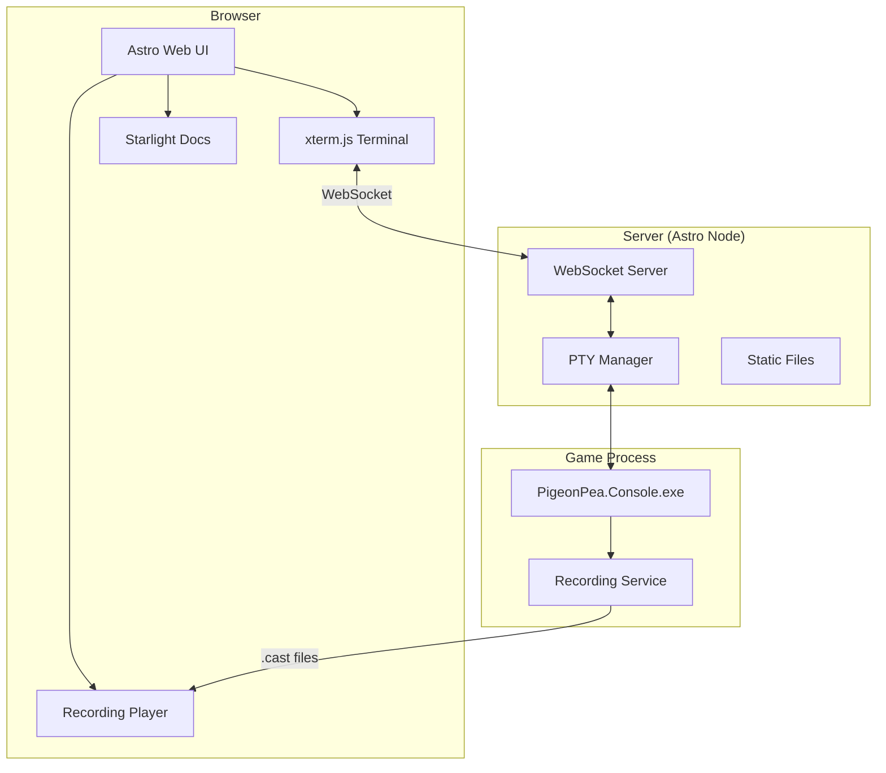

# RFC-057: Interactive Web Portal with Browser-Based Terminal Play

## Status: 📋 DRAFT

## Overview

Transform the current documentation site (`docs-site/`) into a comprehensive web portal that serves both documentation AND interactive gameplay, enabling users to play PigeonPea directly in the browser via xterm.js with PTY-based architecture, view recordings, and manage multiple game sessions.

## Motivation

### Current State

`docs-site/` uses **Astro + Starlight** for documentation only:

- ✅ RFCs, guides, ADRs rendered beautifully
- ❌ No way to play the game in browser
- ❌ No recording playback viewer
- ❌ No multi-session support

### Problems This Solves

| Problem                      | Current                  | Proposed Solution           |
| ---------------------------- | ------------------------ | --------------------------- |
| **Try before download**      | Must install .NET + game | Play in browser immediately |
| **Share gameplay**           | Send .cast files         | Share URL to recording      |
| **Demo to others**           | Screen share or video    | Just send link              |
| **Multi-session dev**        | Run multiple terminals   | Workspace switcher in UI    |
| **Documentation disconnect** | Docs separate from game  | Unified portal              |

### Vision: Unified Game Hub

```
┌────────────────────────────────────────────────────────────┐
│         PigeonPea Web Portal (Astro + Starlight)           │
├────────────────────────────────────────────────────────────┤
│                                                            │
│  🎮 Play               📚 Docs              🎬 Recordings  │
│  ├─ Browser Terminal   ├─ RFCs              ├─ Gallery    │
│  ├─ Multi-workspace    ├─ Guides            ├─ Playback   │
│  └─ Live sessions      └─ Reference         └─ Share      │
│                                                            │
└────────────────────────────────────────────────────────────┘
```

## Architecture

### High-Level Components



### PTY-Based Architecture (Future-Proof)

**Why PTY?**

- ✅ Standard terminal abstraction
- ✅ Works with asciinema recording
- ✅ Easy WebSocket streaming
- ✅ Multi-session support
- ✅ Enable future remote play

**How it works:**

```
User Input (browser)
    → WebSocket
    → PTY process
    → PigeonPea.Console.exe
    → Terminal.Gui rendering
    → PTY captures output
    → WebSocket
    → xterm.js displays
```

## Proposed Directory Structure

### Renamed: `docs-site/` → `web-portal/`

```
web-portal/                              # Renamed from docs-site
├── src/
│   ├── components/
│   │   ├── game/
│   │   │   ├── GameTerminal.astro       # xterm.js integration
│   │   │   ├── WorkspaceManager.tsx     # Multi-session switcher
│   │   │   ├── WorkspacePanel.astro     # Session controls
│   │   │   └── TerminalControls.tsx     # Record/fullscreen buttons
│   │   │
│   │   ├── recordings/
│   │   │   ├── RecordingPlayer.astro    # Asciinema player
│   │   │   ├── RecordingGallery.tsx     # List of recordings
│   │   │   └── RecordingCard.astro      # Thumbnail card
│   │   │
│   │   └── layout/
│   │       ├── CustomHeader.astro       # Portal navigation
│   │       └── Sidebar.astro            # Enhanced sidebar
│   │
│   ├── pages/
│   │   ├── index.astro                  # Landing page
│   │   │
│   │   ├── play/
│   │   │   ├── index.astro              # Main play page
│   │   │   └── [workspace].astro        # Specific workspace session
│   │   │
│   │   ├── recordings/
│   │   │   ├── index.astro              # Recording gallery
│   │   │   └── [id].astro               # Playback viewer
│   │   │
│   │   ├── docs/
│   │   │   └── [...slug].astro          # Starlight documentation
│   │   │
│   │   └── api/
│   │       ├── pty.ts                   # WebSocket PTY endpoint
│   │       ├── workspaces.ts            # Workspace management API
│   │       └── recordings.ts            # Recordings list API
│   │
│   ├── content/
│   │   ├── rfc/                         # Generated from ../docs/rfcs/
│   │   ├── guide/                       # Generated from ../docs/guides/
│   │   ├── adr/
│   │   └── config.ts
│   │
│   ├── lib/
│   │   ├── pty-manager.ts               # PTY process management
│   │   ├── workspace-store.ts           # Workspace state
│   │   └── recording-utils.ts           # Recording helpers
│   │
│   └── styles/
│       ├── terminal.css                 # xterm.js theming
│       └── portal.css                   # Custom styles
│
├── public/
│   ├── recordings/                      # .cast files
│   └── assets/
│
├── astro.config.mjs
├── package.json
└── tsconfig.json
```

## Implementation

### 1. Update astro.config.mjs

```javascript
import { defineConfig } from 'astro/config';
import starlight from '@astrojs/starlight';
import react from '@astrojs/react';
import node from '@astrojs/node';

export default defineConfig({
  output: 'server', // Required for WebSocket support

  adapter: node({
    mode: 'standalone',
  }),

  integrations: [
    react(), // For interactive components (WorkspaceManager, etc.)

    starlight({
      title: 'PigeonPea',
      description: 'Roguelike Game • Documentation • Interactive Portal',

      customCss: ['./src/styles/terminal.css', './src/styles/portal.css'],

      sidebar: [
        {
          label: '🎮 Play',
          items: [
            { label: 'Browser Terminal', link: '/play' },
            { label: 'Recordings Gallery', link: '/recordings' },
          ],
        },
        {
          label: '📚 Documentation',
          items: [
            { label: 'Getting Started', link: '/docs/getting-started' },
            {
              label: 'RFCs',
              autogenerate: { directory: 'rfc' },
              collapsed: true,
            },
            {
              label: 'Guides',
              autogenerate: { directory: 'guide' },
              collapsed: true,
            },
            {
              label: 'ADRs',
              autogenerate: { directory: 'adr' },
              collapsed: true,
            },
          ],
        },
      ],

      components: {
        Header: './src/components/layout/CustomHeader.astro',
      },

      social: {
        github: 'https://github.com/your-org/pigeon-pea',
      },

      favicon: '/favicon.svg',
    }),
  ],

  vite: {
    optimizeDeps: {
      exclude: ['node-pty'],
    },
  },
});
```

### 2. GameTerminal Component (xterm.js)

```astro
---
// src/components/game/GameTerminal.astro
import '@xterm/xterm/css/xterm.css';

interface Props {
  workspaceId?: string;
}

const { workspaceId = 'default' } = Astro.props;
---

<div class="terminal-container">
  <div id="terminal" data-workspace={workspaceId}></div>
  <div class="terminal-status">
    <span id="connection-status">Connecting...</span>
    <span id="terminal-size"></span>
  </div>
</div>

<script>
  import { Terminal } from '@xterm/xterm';
  import { FitAddon } from '@xterm/addon-fit';
  import { WebLinksAddon } from '@xterm/addon-web-links';

  const terminalEl = document.getElementById('terminal')!;
  const workspaceId = terminalEl.dataset.workspace!;
  const statusEl = document.getElementById('connection-status')!;
  const sizeEl = document.getElementById('terminal-size')!;

  // Create terminal
  const term = new Terminal({
    cursorBlink: true,
    fontSize: 14,
    fontFamily: '"Cascadia Code", "Fira Code", "Consolas", monospace',
    theme: {
      background: '#1e1e1e',
      foreground: '#d4d4d4',
      cursor: '#ffffff',
      selection: '#264f78',
      black: '#000000',
      red: '#cd3131',
      green: '#0dbc79',
      yellow: '#e5e510',
      blue: '#2472c8',
      magenta: '#bc3fbc',
      cyan: '#11a8cd',
      white: '#e5e5e5',
    },
    allowProposedApi: true,
  });

  const fitAddon = new FitAddon();
  term.loadAddon(fitAddon);
  term.loadAddon(new WebLinksAddon());

  term.open(terminalEl);
  fitAddon.fit();

  // Update size display
  const updateSize = () => {
    sizeEl.textContent = `${term.cols}×${term.rows}`;
  };
  updateSize();

  // WebSocket connection
  const protocol = window.location.protocol === 'https:' ? 'wss:' : 'ws:';
  const ws = new WebSocket(`${protocol}//${window.location.host}/api/pty?workspace=${workspaceId}`);

  ws.onopen = () => {
    statusEl.textContent = '🟢 Connected';
    statusEl.style.color = '#0dbc79';

    // Send initial size
    ws.send(JSON.stringify({
      type: 'resize',
      cols: term.cols,
      rows: term.rows
    }));
  };

  ws.onclose = () => {
    statusEl.textContent = '🔴 Disconnected';
    statusEl.style.color = '#cd3131';
    term.write('\r\n\x1b[1;31mConnection closed.\x1b[0m\r\n');
  };

  ws.onerror = () => {
    statusEl.textContent = '⚠️ Error';
    statusEl.style.color = '#e5e510';
  };

  // PTY output → Terminal
  ws.onmessage = (event) => {
    if (typeof event.data === 'string') {
      // Text data
      term.write(event.data);
    } else {
      // Binary data
      event.data.arrayBuffer().then((buffer: ArrayBuffer) => {
        term.write(new Uint8Array(buffer));
      });
    }
  };

  // Terminal input → PTY
  term.onData(data => {
    ws.send(data);
  });

  // Handle resize
  const handleResize = () => {
    fitAddon.fit();
    updateSize();

    if (ws.readyState === WebSocket.OPEN) {
      ws.send(JSON.stringify({
        type: 'resize',
        cols: term.cols,
        rows: term.rows
      }));
    }
  };

  window.addEventListener('resize', handleResize);

  // Cleanup
  window.addEventListener('beforeunload', () => {
    ws.close();
  });
</script>

<style>
  .terminal-container {
    display: flex;
    flex-direction: column;
    height: 100%;
    background: #1e1e1e;
    border-radius: 8px;
    overflow: hidden;
    box-shadow: 0 4px 6px rgba(0, 0, 0, 0.3);
  }

  #terminal {
    flex: 1;
    padding: 12px;
  }

  .terminal-status {
    display: flex;
    justify-content: space-between;
    padding: 8px 12px;
    background: #252526;
    border-top: 1px solid #3e3e42;
    font-size: 12px;
    font-family: monospace;
    color: #cccccc;
  }
</style>
```

### 3. PTY WebSocket API

```typescript
// src/pages/api/pty.ts
import type { APIRoute } from 'astro';
import { spawn } from 'node-pty';
import * as os from 'os';
import * as path from 'path';

// Store active PTY sessions
const sessions = new Map<string, any>();

export const GET: APIRoute = async ({ request, url }) => {
  const upgradeHeader = request.headers.get('upgrade');

  if (upgradeHeader !== 'websocket') {
    return new Response('Expected WebSocket', { status: 400 });
  }

  const workspaceId = url.searchParams.get('workspace') || 'default';

  // Check if session already exists
  if (sessions.has(workspaceId)) {
    return new Response('Workspace already active', { status: 409 });
  }

  // Upgrade to WebSocket
  const { socket, response } = Deno.upgradeWebSocket(request);

  // Determine shell and project path
  const shell = os.platform() === 'win32' ? 'powershell.exe' : 'bash';
  const projectPath = path.join(process.cwd(), '../../dotnet/app/console/src/PigeonPea.Console');

  // Spawn PTY process
  const ptyProcess = spawn(shell, [], {
    name: 'xterm-256color',
    cols: 80,
    rows: 24,
    cwd: projectPath,
    env: process.env as any,
  });

  // Store session
  sessions.set(workspaceId, ptyProcess);

  // Auto-start game on Windows
  if (os.platform() === 'win32') {
    setTimeout(() => {
      ptyProcess.write('dotnet run\r');
    }, 500);
  }

  // PTY output → WebSocket
  ptyProcess.onData((data: string) => {
    try {
      socket.send(data);
    } catch (e) {
      console.error('Failed to send to WebSocket:', e);
    }
  });

  // WebSocket messages → PTY
  socket.addEventListener('message', (event) => {
    const data = event.data;

    if (typeof data === 'string') {
      try {
        const msg = JSON.parse(data);

        if (msg.type === 'resize') {
          ptyProcess.resize(msg.cols, msg.rows);
        } else {
          ptyProcess.write(data);
        }
      } catch {
        // Not JSON, treat as raw input
        ptyProcess.write(data);
      }
    } else {
      // Binary data
      ptyProcess.write(data);
    }
  });

  // Cleanup on close
  socket.addEventListener('close', () => {
    console.log(`Workspace ${workspaceId} closed`);
    ptyProcess.kill();
    sessions.delete(workspaceId);
  });

  ptyProcess.onExit(() => {
    socket.close();
    sessions.delete(workspaceId);
  });

  return response;
};
```

### 4. Play Page

```astro
---
// src/pages/play/index.astro
import { GameTerminal } from '../../components/game/GameTerminal.astro';
import { WorkspaceManager } from '../../components/game/WorkspaceManager';

const title = '🎮 Play PigeonPea';
---

<!DOCTYPE html>
<html lang="en">
<head>
  <meta charset="UTF-8">
  <meta name="viewport" content="width=device-width, initial-scale=1.0">
  <title>{title}</title>
  <link rel="stylesheet" href="/styles/portal.css">
</head>
<body>
  <div class="play-container">
    <header>
      <h1>{title}</h1>
      <p>Play the roguelike directly in your browser</p>
    </header>

    <!-- Workspace switcher -->
    <WorkspaceManager client:load />

    <!-- Game terminal -->
    <div class="terminal-wrapper">
      <GameTerminal />
    </div>

    <!-- Controls -->
    <div class="controls">
      <button id="start-recording" class="btn">
        ⏺️ Start Recording
      </button>
      <button id="stop-recording" class="btn" disabled>
        ⏹️ Stop Recording
      </button>
      <button id="fullscreen" class="btn">
        ⛶ Fullscreen
      </button>
      <button id="reset" class="btn btn-danger">
        🔄 Reset Session
      </button>
    </div>

    <!-- Instructions -->
    <div class="instructions">
      <h3>How to Play</h3>
      <ul>
        <li><kbd>Arrow Keys</kbd> - Move</li>
        <li><kbd>Space</kbd> - Attack</li>
        <li><kbd>I</kbd> - Inventory</li>
        <li><kbd>Esc</kbd> - Menu</li>
      </ul>
    </div>
  </div>

  <script>
    // Control button handlers
    document.getElementById('fullscreen')?.addEventListener('click', () => {
      document.querySelector('.terminal-wrapper')?.requestFullscreen();
    });

    document.getElementById('reset')?.addEventListener('click', () => {
      if (confirm('Reset game session? This will lose unsaved progress.')) {
        location.reload();
      }
    });
  </script>
</body>
</html>

<style>
  .play-container {
    max-width: 1200px;
    margin: 0 auto;
    padding: 2rem;
  }

  .terminal-wrapper {
    height: 600px;
    margin: 2rem 0;
  }

  .controls {
    display: flex;
    gap: 1rem;
    margin-bottom: 2rem;
  }

  .btn {
    padding: 0.75rem 1.5rem;
    border: none;
    border-radius: 4px;
    background: #2472c8;
    color: white;
    cursor: pointer;
    font-size: 14px;
    transition: background 0.2s;
  }

  .btn:hover {
    background: #1e5fa8;
  }

  .btn:disabled {
    opacity: 0.5;
    cursor: not-allowed;
  }

  .btn-danger {
    background: #cd3131;
  }

  .btn-danger:hover {
    background: #a82828;
  }

  .instructions {
    background: #f3f3f3;
    padding: 1.5rem;
    border-radius: 8px;
  }

  .instructions kbd {
    background: #fff;
    border: 1px solid #ccc;
    border-radius: 3px;
    padding: 2px 6px;
    font-family: monospace;
    font-size: 12px;
  }
</style>
```

### 5. Workspace Manager Component

```tsx
// src/components/game/WorkspaceManager.tsx
import { useState, useEffect } from 'react';

interface Workspace {
  id: string;
  name: string;
  active: boolean;
  created: Date;
}

export function WorkspaceManager() {
  const [workspaces, setWorkspaces] = useState<Workspace[]>([
    { id: 'default', name: 'Main Session', active: true, created: new Date() },
  ]);

  const createWorkspace = () => {
    const id = `ws-${Date.now()}`;
    const newWorkspace: Workspace = {
      id,
      name: `Session ${workspaces.length + 1}`,
      active: false,
      created: new Date(),
    };

    setWorkspaces([...workspaces, newWorkspace]);
  };

  const switchWorkspace = (id: string) => {
    window.location.href = `/play/${id}`;
  };

  const deleteWorkspace = (id: string) => {
    if (id === 'default') {
      alert('Cannot delete main session');
      return;
    }

    if (confirm('Delete this workspace?')) {
      setWorkspaces(workspaces.filter((ws) => ws.id !== id));
    }
  };

  return (
    <div className="workspace-manager">
      <div className="workspace-tabs">
        {workspaces.map((ws) => (
          <div
            key={ws.id}
            className={`workspace-tab ${ws.active ? 'active' : ''}`}
            onClick={() => switchWorkspace(ws.id)}
          >
            <span className="workspace-name">{ws.name}</span>
            {ws.id !== 'default' && (
              <button
                className="close-btn"
                onClick={(e) => {
                  e.stopPropagation();
                  deleteWorkspace(ws.id);
                }}
              >
                ×
              </button>
            )}
          </div>
        ))}
        <button className="new-workspace-btn" onClick={createWorkspace}>
          + New Session
        </button>
      </div>
    </div>
  );
}
```

### 6. Recording Player

```astro
---
// src/components/recordings/RecordingPlayer.astro
interface Props {
  recordingUrl: string;
  autoplay?: boolean;
}

const { recordingUrl, autoplay = false } = Astro.props;
---

<div class="recording-player">
  <div id="player-container"></div>
  <div class="player-controls">
    <button id="play-pause">▶️ Play</button>
    <button id="restart">🔄 Restart</button>
    <input type="range" id="speed" min="0.5" max="3" step="0.5" value="1" />
    <span id="speed-label">1x</span>
  </div>
</div>

<script define:vars={{ recordingUrl, autoplay }}>
  import 'asciinema-player/dist/bundle/asciinema-player.css';
  import * as AsciinemaPlayer from 'asciinema-player';

  const player = AsciinemaPlayer.create(
    recordingUrl,
    document.getElementById('player-container'),
    {
      autoPlay: autoplay,
      loop: false,
      speed: 1,
      theme: 'monokai'
    }
  );

  // Control handlers
  document.getElementById('play-pause').addEventListener('click', () => {
    if (player.isPlaying()) {
      player.pause();
    } else {
      player.play();
    }
  });

  document.getElementById('restart').addEventListener('click', () => {
    player.seek(0);
  });

  document.getElementById('speed').addEventListener('input', (e) => {
    const speed = parseFloat(e.target.value);
    player.setSpeed(speed);
    document.getElementById('speed-label').textContent = `${speed}x`;
  });
</script>
```

## Updated package.json

```json
{
  "name": "pigeon-pea-web-portal",
  "version": "0.1.0",
  "type": "module",
  "scripts": {
    "dev": "astro dev",
    "build": "astro build",
    "preview": "astro preview",
    "docs:sync": "python ../scripts/docs_mgmt/generate_starlight_wrappers.py"
  },
  "dependencies": {
    "@astrojs/node": "^8.0.0",
    "@astrojs/react": "^3.0.0",
    "@xterm/xterm": "^5.5.0",
    "@xterm/addon-fit": "^0.10.0",
    "@xterm/addon-web-links": "^0.11.0",
    "asciinema-player": "^3.7.0",
    "node-pty": "^1.0.0",
    "react": "^18.3.0",
    "react-dom": "^18.3.0"
  },
  "devDependencies": {
    "@astrojs/mdx": "^3.0.0",
    "@astrojs/starlight": "^0.28.0",
    "@types/node": "^20.0.0",
    "@types/react": "^18.3.0",
    "@types/react-dom": "^18.3.0",
    "astro": "^4.0.0",
    "typescript": "^5.3.0"
  }
}
```

## Migration Plan

### Step 1: Rename Directory

```bash
# Option 1: Direct rename
mv docs-site web-portal

# Option 2: Gradual (keep both temporarily)
cp -r docs-site web-portal
# Test new portal
# Delete docs-site when ready
```

**Suggested names:**

- ✅ `web-portal` (descriptive, clear)
- ✅ `pigeon-pea-web` (scoped, professional)
- ❌ `game-hub` (too casual)
- ❌ `site` (too generic)

**Recommendation: `web-portal`**

### Step 2: Add Dependencies

```bash
cd web-portal
npm install @astrojs/node @astrojs/react
npm install @xterm/xterm @xterm/addon-fit @xterm/addon-web-links
npm install node-pty asciinema-player
npm install react react-dom
npm install -D @types/node @types/react @types/react-dom
```

### Step 3: Implement Components

1. Create `GameTerminal.astro`
2. Create `WorkspaceManager.tsx`
3. Create `/api/pty.ts`
4. Create `/play/index.astro`

### Step 4: Test Locally

```bash
npm run dev
# Visit http://localhost:4321/play
```

### Step 5: Deploy

Update deployment to use Node.js adapter for WebSocket support.

## Benefits Summary

| Feature                | Before             | After                      |
| ---------------------- | ------------------ | -------------------------- |
| **Play game**          | Download + install | Click link, play instantly |
| **Share gameplay**     | Send .cast file    | Share URL                  |
| **Documentation**      | Separate from game | Unified portal             |
| **Multi-session**      | Multiple terminals | Browser tabs               |
| **Recording playback** | Manual tools       | Built-in player            |
| **Discoverability**    | Hidden game        | Discoverable via web       |

## Open Questions

> [!IMPORTANT]
> **Performance**: How many concurrent PTY sessions can we support?
>
> - Recommendation: Limit to 10 per server, add session timeout

> [!IMPORTANT]
> **Security**: Should we add authentication for PTY access?
>
> - Public demo: No auth needed
> - Private hosting: Add OAuth/JWT

> [!IMPORTANT]
> **Recording**: Auto-record all sessions or opt-in?
>
> - Recommendation: Opt-in with clear UI button

## Verification Plan

1. **Local Development**:
   - Test PTY spawning on Windows/Linux/macOS
   - Verify xterm.js rendering
   - Test workspace switching

2. **Integration**:
   - Recording playback works
   - Documentation still renders
   - Multi-session handling

3. **Performance**:
   - Latency < 50ms for local PTY
   - Memory < 100MB per session
   - Clean session cleanup

## Conclusion

Transforming `docs-site` into `web-portal` creates a comprehensive game hub that serves documentation, interactive gameplay, and recording playback in a unified experience, significantly lowering the barrier to trying PigeonPea.

---

_Created: 2025-11-23_
_Status: Draft_
_Dependencies: RFC-00054 (Asciinema Recording)_
_Directory Rename: `docs-site/` → `web-portal/`_
